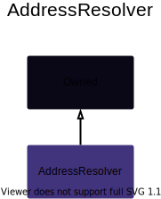

# AddressResolver

## Description

This contract is a type of Service Locator pattern that allows for easier interaction between multiple contracts. Instead of contract A needing references to contracts B and C (and updating ever release), contract A can refer to an `AddressResolver` and query for B and C at transaction time. Then, during a release, the AddressResolver is updated with the latest B and C contarct. Thus this ensures that contract A always has the latest B and C contracts.

**Source:** [AddressResolver.sol](https://github.com/Synthetixio/synthetix/blob/master/contracts/AddressResolver.sol)

## Architecture

---

### Inheritance Graph

<centered-image>
    
</centered-image>

---

## Variables

---

### `repository`

The mapping of contract name to address

**Type:** `mapping(bytes32 => address) public`

---

## Constructor

---

The constructor simply sets this contract as `Owned`.

??? example "Details"

    **Signature**

    `constructor(address _owner) public`

    **Superconstructors**

    * [`Owned(_owner)`](Owned.md#constructor)

---

## Views

---

### `getAddress`

Returns a single address by it's `bytes32` key.

??? example "Details"

    **Signature**

    `getAddress(bytes32 name) public view returns (address)`

---

## Owner Functions

---

### `importAddresses`

Import one or more addresses into the system for the given keys. Note: this function will overrwite any previous entries with the same key names, allowing for inline updates.

??? example "Details"

    **Signature**

    `importAddresses(bytes32[] names, address[] destinations) public`

    **Modifiers**

    * [`Owned.onlyOwner`](Owned.md#onlyowner)

    **Preconditions**

    * The length of `names` must match the length of `destinations`

---
