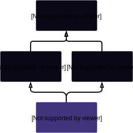
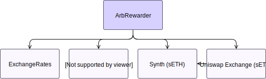

# ArbRewarder

!!! todo "Work in Progress"

    More work required on this page

## Description

Initial Gitcoin Bounty: https://github.com/Synthetixio/synthetix/issues/188

Announcement Post: https://blog.synthetix.io/our-new-seth-snx-arb-contract-is-now-live/

**Source:** [`ArbRewarder.sol`](https://github.com/Synthetixio/synthetix/blob/arb-rewarder/contracts/ArbRewarder.sol)

## Architecture

---

### Inheritance Graph

<centered-image>
    
</centered-image>

---

### Related Contracts

<centered-image>
    
</centered-image>

??? example "Details"

    * [Uniswap Exchange (sETH)](https://etherscan.io/address/0xe9Cf7887b93150D4F2Da7dFc6D502B216438F244): This is the market through which the arbitrage is performed.
    * [`ExchangeRates`](ExchangeRates.md): The current SNX/ETH price is retrieved from the exchange rates contract.
    * [`Synth (sETH)`](Synth.md): One half of the sETH/ETH pair.
    * [`Synthetix (Proxy)`](Synthetix.md): The ArbRewarder rewards the caller with the arb profit as SNX.

---

### Libraries

- [`SafeMath`](SafeMath.md) for `uint`
- [`SafeDecimalMath`](SafeDecimalMath.md) for `uint`

---

## Variables

---

### `off_peg_min`

---

### `acceptable_slippage`

---

### `max_delay`

---

### `divisor`

---

### `seth_exchange_addr`

---

### `snx_erc20_addr`

---

### `synthetix_rates`

---

### `seth_uniswap_exchange`

---

### `seth_erc20`

---

### `snx_erc20`

---

## Functions

---

### `constructor`

---

### `setParams`

---

### `setSynthetix`

---

### `setSynthetixETHAddress`

---

### `setExchangeRates`

---

### `recoverETH`

---

### `recoverERC20`

---

### `addEth`

---

### `isArbable`

---

### `rewardCaller`

---

### `expectedOutput`

---

### `applySlippage`

---

### `maxConvert`

---

### `sqrt`

---

### `min`

---

## Modifiers

### `rateNotStale`
