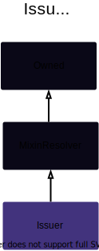
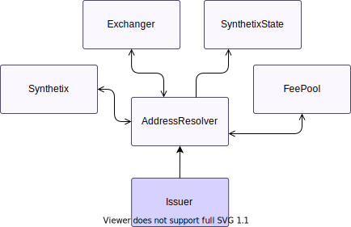
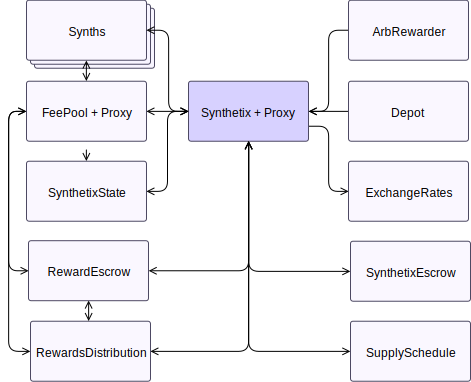

# Issuer

??? todo "Work In Progress"

    Ongoing...

## Description

This contract does all the heavy lifting of issuing and burning `sUSD`. It's used primarily to reduce the size of the `Synthetix` contract

**Source:** [Issuer.sol](https://github.com/Synthetixio/synthetix/blob/master/contracts/Issuer.sol)

## Architecture

---

### Inheritance Graph

<centered-image>
    
</centered-image>

---

### Related Contracts

<centered-image>
    
</centered-image>

??? example "Details"

    - [`FeePool`](FeePool.md): The Synthetix contract remits exchange fees as sUSD to the fee pool, and also uses it to keep track of historical issuance records for each issuer.
    - [`SynthetixState`](SynthetixState.md): This state contract stores the debt ledger and the current issuance information for synth issuers.

---

<!--
If any, see:

<centered-image>
    
</centered-image>
--->

---

## Constants

---

<!-- E.g.

### `TOKEN_NAME`

A constant used to initialise the ERC20 [`ExternStateToken.name`](ExternStateToken.md#name) field upon construction.

**Type:** `string constant`

**Value:** `"Synthetix Network Token"`
-->

---

## Variables

---

<!-- e.g.

### `first`

Something

**Type:** `address public`

-->

---

## Constructor

---

<!-- E.g.
The constructor initialises the various addresses that this contract knows about, as well as the inherited [`ExternStateToken`](ExternStateToken.md) instance.

??? example "Details"

    **Signature**

    `constructor(address _proxy, TokenState _tokenState, SynthetixState _synthetixState, address _owner, ExchangeRates _exchangeRates, FeePool _feePool, SupplySchedule _supplySchedule, SynthetixEscrow _rewardEscrow, SynthetixEscrow _escrow, RewardsDistribution _rewardsDistribution, uint _totalSupply) public`

    **Superconstructors**

    * [`ExternStateToken(_proxy, _tokenState, TOKEN_NAME, TOKEN_SYMBOL, _totalSupply, DECIMALS, _owner)`](ExternStateToken.md#constructor)

-->

---

## Views

---

<!-- E.g.
### `availableCurrencyKeys`

Returns the [currency key](Synth.md#currencykey) for each synth in [`availableSynths`](#availablesynths).

??? example "Details"

    **Signature**

    `availableCurrencyKeys() public view returns (bytes32[])`

-->

---

## Mutative Functions

---

<!-- E.g.

### `burnSynths`

[Burns](Synth.md#burn) a quantity of `sUSD` in the calling address, in order to free up its locked SNX supply.

If the caller attempts to burn more synths than their SNX debt is worth, this function will only burn sufficiently many tokens to cover the debt and leave the rest untouched.

The new debt position of the caller is recorded with [`_appendAccountIssuanceRecord`](#appendaccountissuancerecord), and the adjustment to global debt recorded with [`_removeFromDebtRegister`](#_removefromdebtregister).

??? example "Details"

    **Signature**

    `burnSynths(uint amount) external`

    **Modifiers**

    * [`Proxyable.optionalProxy`](Proxyable.md#optionalproxy)

    **Preconditions**

    * The [existing debt](#debtbalanceof) the caller must be nonzero.

--->

---

## Owner Functions

---

<!-- Eg.

### `importAddresses`

Import one or more addresses into the system for the given keys. Note: this function will overrwite any previous entries with the same key names, allowing for inline updates.

??? example "Details"

    **Signature**

    `importAddresses(bytes32[] names, address[] destinations) public`

    **Modifiers**

    * [`Owned.onlyOwner`](Owned.md#onlyowner)

    **Preconditions**

    * The length of `names` must match the length of `destinations`

---

-->

---

## Internal & Restricted Functions

---

## Modifiers

---

<!-- E.g.
### `notFeeAddress`

The transaction is reverted if the given account is the [fee address](FeePool.md#fee_address).

**Signature:** `notFeeAddress(address account)`
-->

---

## Events

---

<!--

 E.g.

### `SynthExchange`

Records that an [exchange](#exchange) between two flavours of synths occurred.

This event is emitted from the Synthetix [proxy](Proxy.md#_emit) with the `emitSynthExchange` function.

**Signature:** `SynthExchange(address indexed account, bytes32 fromCurrencyKey, uint256 fromAmount, bytes32 toCurrencyKey, uint256 toAmount, address toAddress)`

-->

---
