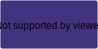

# Owned

## Description

Allows inheriting contracts to have an owner and provides the [`onlyOwner`](#onlyowner) modifier, which restricts function access to that owner.
The owner can be changed by a nomination process, where the nominated owner must accept ownership before it is switched.

**Source:** [Owned.sol](https://github.com/Synthetixio/synthetix/blob/master/contracts/Owned.sol)

## Architecture

---

### Inheritance Graph

<centered-image>
    
</centered-image>

---

## Variables

---

### `owner`

The contract owner.

**Type:** `address public`

---

### `nominatedOwner`

The currently-nominated owner.

**Type:** `address public`

---

## Functions

---

### `constructor`

Initialises the owner of this contract.

??? example "Details"

    **Signature**

    `constructor(address _owner) public`

    **Preconditions**

    * The initial owner cannot be the zero address.

    **Emits**

    * [`OwnerChanged(address(0), _owner)`](#ownerchanged)

---

### `nominateNewOwner`

Nominates a new owner of this contract, who may then call [`acceptOwnership`](#acceptownership) to become the owner.

??? example "Details"

    **Signature**

    `nominateNewOwner(address _owner) external`

    **Modifiers**

    * [`onlyOwner`](#onlyowner)

    **Emits**

    * [`OwnerNominated(_owner)`](#ownernominated)

---

### `acceptOwnership`

If called by [`nominatedOwner`](#nominatedowner), ownership is transferred to that address.
The nominated owner is reset to the zero address.

??? example "Details"

    **Signature**

    `acceptOwnership() external`

    **Preconditions**

    * The caller must be [`nominatedOwner`](#nominatedowner).

    **Emits**

    * [`OwnerChanged(owner, nominatedOwner)`](#ownerchanged)

---

## Modifiers

---

### `onlyOwner`

Reverts the transaction if `msg.sender` is not the [`owner`](#owner).

---

## Events

---

### `OwnerNominated`

`newOwner` has been set as the [`nominatedOwner`](#nominatedowner).

**Signature:** `OwnerNominated(address newOwner)`

---

### `OwnerChanged`

Ownership has been handed over from `oldOwner` to `newOwner`, which is the new value of [`owner`](#owner).

**Signature:** `OwnerChanged(address oldOwner, address newOwner)`

---
