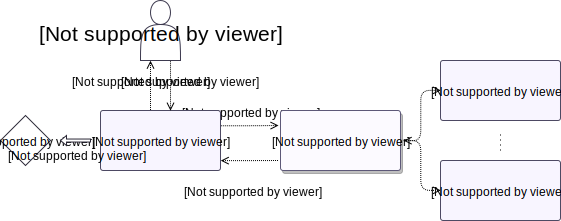

# Proxy

## Description

!!! info "General Ethereum Proxy Architecture"

    The typical smart contact Proxy pattern is discussed in depth [here](https://blog.openzeppelin.com/proxy-patterns/) and [here](https://fravoll.github.io/solidity-patterns/proxy_delegate.html). This implementation has its own architecture, however, and is not identical to most other proxy contracts.

The Synthetix proxy sits in front of an underlying target contract. Any calls made to the proxy [are forwarded](#fallback-function) to that target contract, so it appears as if the target was called. This is designed to allow a contract to be upgraded without altering its address.
In Synthetix, this proxy typically operates in tandem with a [`Proxyable`](Proxyable.md) instance as its target. In this configuration, events are always emitted at the proxy, not at the target, even if the target is called directly.

The [`Synthetix`](Synthetix.md), [`Synth`](Synth.md), and [`FeePool`](FeePool.md) contracts all exist behind proxies, which has allowed their behaviour to be substantially altered over time.

This proxy provides two different operation modes,[^1] which can be switched between at any point.

[^1]: Specific descriptions of the behaviour of the `CALL` and `DELEGATECALL` EVM instructions can be found in the [Ethereum Yellow Paper](https://ethereum.github.io/yellowpaper/paper.pdf).

- `DELEGATECALL`: Execution of the target's code occurs in the proxy's context, which preserves the message sender and writes state updates to the storage of the proxy itself. This is the standard proxy style used across most Ethereum projects.
- `CALL`: Execution occurs in the target's context, so the storage of the proxy is never touched, but function call and event data, as well as the message sender, must be explicitly passed between the proxy and target contracts. This is the style mainly used in Synthetix.

The motivation for the `CALL` style was to allow complete decoupling of the storage structure from the proxy, except what's required for the proxy's own functionality. This means there's no necessity for the proxy to be concerned in advance with the storage architecture of the target contract. We can avoid using elaborate or unstructured storage solutions for state variables, and there are no constraints on the use of (possibly nested) mapping or reference types.

Instead of executing the target code in its own context, the `CALL`-style proxy forwards function call data and ether to the target contract that defines the application logic, which then in turn relays information back to the proxy to be returned to the original caller, or to be emitted from the proxy as events. Some state can be kept on the underlying contract if it can be discarded or it is easy to migrate during contract upgrades.
This means that the contract's state is conveniently inspected on block explorers such as [Etherscan](https://etherscan.io/) after the underlying contract code is verified.
More elaborate data is kept in separate storage contracts that persist across multiple versions.

This allows the proxy's target contract to be largely disposable. This structure looks something like the following:

<centered-image>
    
</centered-image>

In this way the main contract defining the logic can be swapped out without replacing the proxy or state contracts. The user only ever communicates with the proxy and need not know any implementation details.
This architecture also allows [multiple proxies](Proxyable.md#integrationproxy) with differing interfaces to be used simultaneously for a single underlying contract, though events will usually be emitted only from one of them. This feature is currently used by [`ProxyERC20`](ProxyERC20.md), which operates atop the [`Synthetix`](Synthetix.md) contract.

There are some tradeoffs to this approach. There is potentially a little more communication overhead for event emission, though there may be some savings available elsewhere depending on system and storage architecture and the particular application.

At the code level, a `CALL` proxy is not entirely transparent. Target contracts must inherit [`Proxyable`](Proxyable.md) so that they can read the message sender which would otherwise be the proxy itself rather than the proxy's caller.
Additionally, events are a bit different; they must be encoded within the underlying contract and then passed back to the proxy to be emitted. The nuts and bolts of event emission are discussed in the [`_emit`](#_emit) section.

Finally, if the target contract needs to transfer ether around, then it will be remitted from the target address rather than the proxy address, though this is a quirk which it would be straightforward to remedy.

**Source:** [Proxy.sol](https://github.com/Synthetixio/synthetix/blob/master/contracts/Proxy.sol)

## Architecture

---

### Inheritance Graph

<centered-image>
    
</centered-image>

---

### Related Contracts

- [Proxyable](Proxyable.md)

---

## Variables

---

### `target`

The underlying contract this proxy is standing in front of.

**Type:** `Proxyable public`

---

### `useDELEGATECALL`

This toggle controls whether the proxy is in `CALL` or `DELEGATECALL` mode. The contract is in `DELEGATECALL` mode iff `useDELEGATECALL` is true.

**Type:** `bool public`

---

## Functions

---

### `constructor`

Initialises the inherited [`Owned`](Owned.md) instance.

??? example "Details"

    **Signature**

    `constructor(address _owner) public`

    **Superconstructors**

    * [`Owned(_owner)`](Owned.md#constructor)

---

### `setTarget`

Sets the address this proxy forwards its calls to.

??? example "Details"

    **Signature**

    `setTarget(Proxyable _target) external`

    **Modifiers**

    * [`Owned.onlyOwner`](Owned.md#onlyOwner)

    **Emits**

    * [`TargetUpdated(_target)`](#targetupdated)

---

### `setUseDELEGATECALL`

Selects which call style to use by setting [`useDELEGATECALL`](#usedelegatecall).

??? example "Details"

    **Signature**

    * `setUseDELEGATECALL(bool value) external`

    **Modifiers**

    * [`Owned.onlyOwner`](Owned.md#onlyOwner)

---

### `_emit`

When operating in the `CALL` style, this function allows the proxy's underlying contract (and only that contract) to emit events from the proxy's address.

**Usage**

Assuming our event signature is `MyEvent(A indexed indexedArg, B data1, C data2)`, invocation in an underlying contract looks something like the following:

`proxy._emit(abi.encode(data1, data2), 2, keccak256('MyEvent(A,B,C)'), bytes32(indexedArg), 0, 0);`

In the implementation, such expressions are typically wrapped in convenience functions like `emitMyEvent(A indexedArg, B data1, C data2) internal` whose signature mirrors that of the event itself.

In Solidity, `indexed` arguments are published as log topics, while non-`indexed` ones are abi-encoded together in order and included as data.
The keccak-256 hash of the Solidity event signature is always included as the first topic. The format of this signature is `EventName(type1,...,typeN)`, with no spaces between the argument types, omitting the `indexed` keyword and the argument name. For more information, see the official Solidity documentation [here](https://solidity.readthedocs.io/en/v0.5.11/contracts.html#events) and [here](https://solidity.readthedocs.io/en/v0.5.11/abi-spec.html#abi-events).

This function takes 4 arguments for log topics. How many of these are consumed is determined by the `numTopics` argument, which can take the values from 0 to 4, corresponding to the EVM `LOG0` to `LOG4` instructions.
In the case that an event has fewer than 3 indexed arguments, the remaining slots can be provided with 0. Any excess topics are simply ignored.
Note that 0 is a valid argument for `numTopics`, which produces `LOG0`, an "event" that only has data and no signature.

!!! caution

    If this proxy contract were to be rewritten with Solidity v0.5.0 or above, it would be necessary to slightly simplify the calls to `abi.encode` with `abi.encodeWithSignature`.

    See [the official Solidity documentation](https://solidity.readthedocs.io/en/v0.5.11/050-breaking-changes.html#semantic-and-syntactic-changes) for more discussion. The exact behaviour of the abi encoding functions is defined [here](https://github.com/ethereum/solidity/blob/7dcc47ed57f5a6ea3761e54da5a4d7bbe055b5a7/libsolidity/codegen/ExpressionCompiler.cpp#L973).

??? example "Details"

    **Signature**

    `_emit(bytes callData, uint numTopics, bytes32 topic1, bytes32 topic2, bytes32 topic3, bytes32 topic4) external`

    **Modifiers**

    * [`onlyTarget`](#onlytarget)

    **Emits**

    This function can emit any possible event.

---

### `() (fallback function)`

If none of the above functions is hit, then the function call data and gas is forwarded to the [target contract](#target). The result of that invocation is returned to the message sender.

If the proxy is in `DELEGATECALL` style, it operates like most other proxies.
If it is in `CALL` mode, then it first calls [`target.setMessageSender(msg.sender)`](Proxyable.md#setmessagesender) to initialise the [`messageSender`](Proxyable.md#messagesender) variable in the underlying [`Proxyable`](Proxyable.md) instance. In addition it forwards any ether included in the transaction to its target.

??? example "Details"

    **Signature**

    `() external payable`

---

## Modifiers

---

### `onlyTarget`

Reverts the transaction if `msg.sender` is not the [`target`](#target) contract.

---

## Events

---

### `TargetUpdated`

The proxy's target contract was changed.

**Signature:** `TargetUpdated(Proxyable newTarget)`
