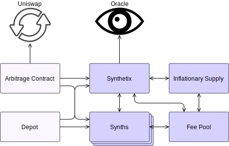

# Smart Contract Architecture

Here you will find descriptions of the smart contract interfaces of every smart contract in the Synthetix system. These documents go a bit further than the code does. These documents try to emphasise the reasons behind the architecture, specifically highlighting interactions between system components. The technical aspects of the system are also discussed together with the details of the incentive mechanism, and with links back to governance processes.

Developers wishing to understand Synthetix code and the tradeoffs within it will be well-advised to read these documents alongside the Solidity itself.

The addresses of currently-deployed contract instances are available in the [Deployments](deployments.md) section.

!!! info "Version"
This documentation is current as of commit TODO.

## Overview

The Synthetix system is composed of a number of core contract complexes, and several auxiliary contracts that enhance token liquidity and general system functionality. These on-chain entities and how they communicate is reflected in the following high-level diagram.

<centered-image>
    
</centered-image>

The oracle, Synthetix, synths, inflationary supply, and fee pool elements comprise the core of the system. The arbitrage and depot contracts are supporting components which, while they do not alter the fundamental behaviour of system tokens, ensure the economic health of the system. They do this by making sure that SNX and synths flow freely through markets like Uniswap and Mintr, improving liquidity and encouraging prices to be close to their theoretically correct values.

Each of the elements in this graph may be a complex composed of several contracts, as described below. Some relatively unimportant links have been omitted, but more detailed descriptions are available at the documentation pages for each specific contract.

## Core Components

---

### Synthetix

!!! example "Responsibilities"
_ Implements the SNX token.
_ Tracks operational synths.
_ Issues and burns synths.
_ Exchanges between synth flavours.
_ Mints the inflationary supply.
_ Maintains the system debt ledger.

Synthetix contract communicates with [synths](#synths) to manage their supply, as well as the [fee pool](#fee-pool) to remit fees when synth exchanges occur. In order to properly convert between synths, and to understand value of debt induced by minting tokens, the Synthetix contract retrieves current token prices from the [oracle](#oracle). This contract also communicates with the [inflationary supply](#inflationary-supply) complex to mint the correct quantity when expanding the supply of SNX, and to distribute the new tokens appropriately.

Along with the debt ledger, which is a time series history of the overall value of the synthetix ecosystem, issuance data for the current fee period is updated whenever synths are issued or burnt. This complex is also responsible for pushing historical issuance information to the fee pool, so that as fee periods roll over, a record of what portion of the total system debt is owned by different issuers is known when computing their fee entitlements.

**Constituent Contracts**

| Contract                              | Description                                                                                                      |
| ------------------------------------- | ---------------------------------------------------------------------------------------------------------------- |
| [`Synthetix`](Synthetix.md)           | The main token contract.                                                                                         |
| [`SynthetixState`](SynthetixState.md) | An auxiliary state contract that sits alongside Synthetix, which tracks current issuer data and the debt ledger. |

---

### Synth

!!! example "Responsibilities"
_ Implements all synth tokens.
_ Liquidates frozen inverse synths.

Many instances of the Synth token contract are deployed, one for each flavour of synth, including inverse synths. Since they run the same logic, synths are largely interchangeable, being distinguished only by their names and prices.

Synths implement their own issuance and burning logic, but only the [Synthetix](#synthetix) and [fee pool](#fee-pool) contracts may invoke them. The Synthetix contract uses these functions for issuance and burning by stakers, while the fee pool uses them to convert synths collected as fees to XDRs when they are deposited into the fee pool address.

Purgeable Synths also retrieve prices from the [oracle](#oracle) at the time of their liquidation to check if the value of their circulating supply is low enough to liquidate.

**Constituent Contracts**

| Contract                              | Description                                                                                                                                                             |
| ------------------------------------- | ----------------------------------------------------------------------------------------------------------------------------------------------------------------------- |
| [`Synth`](Synth.md)                   | The base ERC20 token contract comprising most of the behaviour of all synths. Each synth has an associated [proxy](Proxy.md) and [token state](TokenState.md) contract. |
| [`PurgeableSynth`](PurgeableSynth.md) | A synth contract that can be liquidated at the end of its life, if its supply is low enough or it is a frozen inverse synth.                                            |

---

### Fee Pool

!!! example "Responsibilities"
_ Computes fee entitlements based on the current exchange fee rate and incentive structure, to incentivise users to keep the system operating correctly.
_ Defines the boundaries of recent fee periods, tracking the fees and rewards to be distributed in each one.
_ Allows anyone to roll over to the next fee period once the current one has closed.
_ Accumulates synth exchange fees, holding them as a pool of XDR synths.
_ Directs the [`RewardEscrow`](RewardEscrow.md) to escrow inflationary SNX rewards for eligible issuers.
_ Stores and manages the details of the last several mint/burn events for each account, in order to compute the quantity of fees and rewards they are owed for the past several fee periods. \* Allows issuers (or their delegated hot wallets) to claim any fees and rewards owed to them.

Since the collection of exchange fees on synths is mediated through the [`Synthetix.exchange`](Synthetix.md#exchange) function, the fee pool interacts closely with both the [`Synthetix`](Synthetix.md) and [`Synth`](Synth.md) contracts.

The [`Synthetix`](Synthetix.md) contract informs the fee pool when [fees are collected](FeePool.md#feepaid), and it is allowed to append historic issuance records to its own [account issuance ledger](FeePoolState.md#accountissuanceledger). The fee pool mostly interacts with other system components through [`Synthetix`](Synthetix.md). For example, it only interacts with the oracle through the Synthetix contract, in order to perform conversions into XDRs. It also retrieves other data from there, like debt ledger information, issuance and collateralisation ratios, and the addresses of synth contracts.

As the fee pool is responsible for computing the quantity of both exchange fees and inflationary rewards that issuers are entitled to, it also communicates with the [inflationary supply complex](#inflationary-supply). In particular, the [`RewardsDistribution`](RewardsDistribution.md) contract is allowed to set the level of inflationary rewards to be distributed through the fee pool, which then disburses them by adding new vesting schedule entries in the [`RewardEscrow`](RewardEscrow.md) contract.

**Constituent Contracts**

| Contract                                            | Description                                                                                                    |
| --------------------------------------------------- | -------------------------------------------------------------------------------------------------------------- |
| [`FeePool`](FeePool.md)                             | The main contract responsible for computing and storing the level of fees and rewards issuers are entitled to. |
| [`FeePoolState`](FeePoolState.md)                   | Stores a limited history of issuance data per user.                                                            |
| [`FeePoolEternalStorage`](FeePoolEternalStorage.md) | Stores fee withdrawal times for each address.                                                                  |
| [`DelegateApprovals`](DelegateApprovals.md)         | Allows addresses to delegate to others the right to claim fees on their behalf.                                |

---

### Inflationary Supply

!!! example "Responsibilities"
_ Defines the schedule according to which SNX tokens are generated from the inflationary supply.
_ Tracks for each year how many inflationary tokens have been minted so far, and how many remain.
_ Distributes inflationary rewards to different recipients in the proportions specified by the protocol; that is for staking versus providing Uniswap liquidity.
_ Holds the minted inflationary rewards in escrow for a year after they are claimed. \* Holds and distributes the escrowed tokens from the original token sale.

The inflationary supply complex is concerned with controlling the flow of new SNX tokens being injected into the market. In this capacity it communicates with the [`Synthetix`](Synthetix.md) contract. The actual fraction of the weekly SNX rewards that a particular account is entitled to claim is computed by the [fee pool](#fee-pool), which is able to direct the [`RewardEscrow`](RewardEscrow.md) and [`RewardsDistribution`](RewardsDistribution.md) contracts as to how they should distribute the new tokens.

**Constituent Contracts**

| Contract                                        | Description                                                                                                                                                      |
| ----------------------------------------------- | ---------------------------------------------------------------------------------------------------------------------------------------------------------------- |
| [`SupplySchedule`](SupplySchedule.md)           | Determines the rate that inflationary SNX tokens are released.                                                                                                   |
| [`RewardEscrow`](RewardEscrow.md)               | Receives inflationary SNX rewards to be distributed after a year escrow.                                                                                         |
| [`RewardsDistribution`](RewardsDistribution.md) | Apportions designated quantities of inflationary rewards to the [`RewardEscrow`](RewardEscrow.md) and [`SynthetixAirdropper`](SynthetixAirdropper.md) contracts. |
| [`SynthetixAirdropper`](SynthetixAirdropper.md) | Distributes tokens from the inflationary supply to individual residents of the the UniSwap ETH/sETH liquidity pool.                                              |
| [`SynthetixEscrow`](SynthetixEscrow.md)         | Holds the escrowed balances of SNX from the original token sale.                                                                                                 |
| [`EscrowChecker`](EscrowChecker.md)             | Augments the [`SynthetixEscrow`](SynthetixEscrow.md) contract with a function for dApps to conveniently query it.                                                |

---

### Oracle

!!! example "Responsibilities"
_ Updates, stores, and distributes up-to-date token prices relevant to the system.
_ Computes the prices of inverse synths.
_ Disables exchange functionality if prices are not fresh.
_ Detects and mitigates attempted front-running, for example by locking exchanges while prices are being updated, or activating the exchange [protection circuit](Synthetix.md#protectioncircuit).
_ Provides functionality to perform exchange rate conversions between synth flavours.
_ Computes the price of the XDR.

The on-chain manifestation of the oracle is the [`ExchangeRates`](ExchangeRates.md) contract, whose stored prices it frequently updates. The primary user of these prices is the [`Synthetix`](Synthetix.md) contract, which needs them to calculate debt allocations when issuing and burning synths, and to determine the correct quantity of synths when performing an exchange of one flavour for another.

It is also used by some other contracts, such as the [`ArbRewarder`](ArbRewarder.md) and [`PurgeableSynth`](PurgeableSynth.md) contracts.

**Constituent Contracts**

| Contract                            | Description                                                                                                                                                                                                                                                      |
| ----------------------------------- | ---------------------------------------------------------------------------------------------------------------------------------------------------------------------------------------------------------------------------------------------------------------- |
| Oracle                              | The oracle is responsible for collecting and updating all token prices known to the Synthetix system. Although it is not a contract, it controls a known Ethereum address from which price updates are sent to the [`ExchangeRates`](ExchangeRates.md) contract. |
| [`ExchangeRates`](ExchangeRates.md) | The Synthetix exchange rates contract which receives token prices from the oracle, and supplies them to all contracts that need it.                                                                                                                              |

---

## Token Circulation

---

### Depot

!!! example "Responsibilities" \* TODO (also flesh out the description here)

The [`Depot`](Depot.md) is a vendor contract that allows users to exchange their ETH for sUSD or SNX, or their sUSD for SNX. It also allows users to deposit Synths to be sold in exchange for ETH.

The depot has its own dedicated oracle, and all exchanges are performed at the current market prices, assuming sUSD is priced at one dollar.

---

### Uniswap Arbitrage Contract

!!! example "Responsibilities" \* TODO (also flesh out the description here)

The [ArbRewarder](ArbRewarder.md) automates the process of arbitraging the ETH/sETH price on UniSwap through Synthetix conversion functions.

---

## Infrastructure

---

### Proxy

!!! example "Responsibilities"
_ Provides static addresses for contracts where the underlying logic can be upgraded.
_ Provides the interface that allows contracts to operate beneath a proxy.

Each contract which uses a [proxy](Proxy.md) must inherit from [`Proxyable`](Proxyable.md). Function calls are forwarded from the proxy to the proxyable base, while return data and event information travels the other way. Ultimately most contracts should communicate with one another by proxy. See [SIP-16](https://sips.synthetix.io/sips/sip-16) for more discussion.

The [`Synthetix`](Synthetix.md), [`FeePool`](FeePool.md), and all [`Synth`](Synth.md) contracts exist behind their own individual proxies.

**Contracts**

| Contract                      | Description                                                                      |
| ----------------------------- | -------------------------------------------------------------------------------- |
| [`Proxy`](Proxy.md)           | The Synthetix proxy contract.                                                    |
| [`ProxyERC20`](ProxyERC20.md) | A proxy contract which explicitly supports the ERC20 interface.                  |
| [`Proxyable`](Proxyable.md)   | An abstract base contract designed to work with the [Synthetix proxy](Proxy.md). |

---

### Utilities

These contracts mostly are not deployed on their own, but provide functionality inherited by other contracts already listed.

**Contracts**

| Contract                                        | Description                                                                                                      |
| ----------------------------------------------- | ---------------------------------------------------------------------------------------------------------------- |
| [`SafeDecimalMath`](SafeDecimalMath.md)         | A library for performing fixed point arithmetic at two different precision levels.                               |
| [`SafeMath`](SafeMath.md)                       | OpenZeppelin guarded arithmentic library, used by [`SafeDecimalMath`](SafeDecimalMath.md) and others.            |
| [`Owned`](Owned.md)                             | A contract with a distinct owner who can have special privileges.                                                |
| [`LimitedSetup`](LimitedSetup.md)               | A contract which can disable functions a set time after deployment.                                              |
| [`State`](State.md)                             | An external state contract which can restrict its fields to be modifiable only by a particular contract address. |
| [`SelfDestructible`](SelfDestructible.md)       | A contract that can be self destructed by its owner after a delay.                                               |
| [`Pausable`](Pausable.md)                       | A contract whose operations can be paused by its owner.                                                          |
| [`ReentrancyPreventer`](ReentrancyPreventer.md) | Implements a mutex that prevents re-entrant function calls.                                                      |
| [`EternalStorage`](EternalStorage.md)           | A persistent/unstructured smart contract storage pattern.                                                        |
| [`ExternStateToken`](ExternStateToken.md)       | A partial ERC20 token contact with an external state, which all tokens in Synthetix are built upon.              |
| [`TokenState`](TokenState.md)                   | A state contract to be used with [`ExternStateToken`](ExternStateToken.md) to store balances.                    |
| [`Migrations`](Migrations.md)                   | Truffle migrations contract.                                                                                     |

---

## Audit History

Security and correctness are paramount goals for any smart contract
system. Therefore several different audit partners have been engaged
over the history of the Synthetix project in a continuing process to
validate the integrity of its smart contract system.

| Auditor                               | Subject                                                                                                                                                                      | Date          |
| ------------------------------------- | ---------------------------------------------------------------------------------------------------------------------------------------------------------------------------- | ------------- |
| [iosiro](https://www.iosiro.com/)     | [Synthetix Multicurrency](https://www.iosiro.com/audits/synthetix-smart-contract-audit)                                                                                      | February 2019 |
| [Sigma Prime](https://sigmaprime.io/) | [Synthetix Multicurrency](https://www.synthetix.io/uploads/sigma-prime-synthetix-audit-report_2_0.pdf)                                                                       | January 2019  |
| [Sigma Prime](https://sigmaprime.io/) | [Havven IssuanceController](https://github.com/sigp/public-audits/blob/master/havven-2018-06-18/review.pdf)                                                                  | June 2018     |
| [Cryptecon](https://cryptecon.org/)   | [Havven nUSD economics](https://old.havven.io/uploads/havven_cryptecon_report_may_2018.pdf) ([blog post](https://blog.synthetix.io/havven-validated-by-cryptecon-analysis/)) | June 2018     |
| [Sigma Prime](https://sigmaprime.io/) | [Havven nUSD](https://github.com/sigp/public-audits/blob/master/havven-2018-06-06/havven-review.pdf)                                                                         | June 2018     |
| [Sigma Prime](https://sigmaprime.io/) | [Havven eUSD](https://github.com/sigp/public-audits/tree/master/havven-2018-04-05/README.md)                                                                                 | April 2018    |

---
