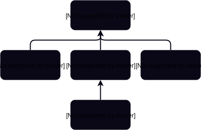

# FeePool

A contract for managing and claiming fees. Note that most logic related to of the transfer fee related logic is superfluous, as the transfer fee rate is 0.

* SIP-2: Eliminates fee penalty tiers and replaces them with a flat 100% penalty if above a target ratio.

This contract was updated as a part of [SIP-4](https://github.com/Synthetixio/SIPs/blob/master/SIPS/sip-4.md). As the contract requires fees to roll over through the entire fee window before incentive changes are actually felt, the system is a little unresponsive. To combat this, the fee window was reduced from six weeks to three weeks, which reduced the lag time between user action and the rewards actually being withdrawable.

!!! note
    The SIP says that the fee window was reduced to two weeks, but the actual contract code sets it to three.

## Inheritance Graph



## Libraries

* [SafeMath](SafeMath.md) for uint
* [SafeDecimalMath](SafeDecimalMath.md) for uint

## Related Contracts

* \<\>[Proxy](Proxy.md) (through `Proxyable`)
* \<\>[RewardEscrow](RewardEscrow.md)
* \<\>[FeePoolEternalStorage](FeePoolEternalStorage.md) (back link: `State.associatedContract`)
* \<\>[FeePoolState](FeePoolState.md)
* \<\>[DelegateApprovals](DelegateApprovals.md) (back link: `State.associatedContract`)
* \<\>[Synth](Synth.md) (Note that the forward link only exists transiently in the `_payFees` function: a link to `XDR`s is always instantiated, in order to burn from the fee pool, and a link per destination currency to be minted)
* \<\>[Synthetix](Synthetix.md)
* \>[SynthetixState](SynthetixState.md)
* \<[Depot](Depot.md)

## Deployed Instances

Network | Address
------- | -------
Mainnet | [0x5e5F5542dAd3E06CC8E1cd2461E83f872835117B](https://etherscan.io/address/0x5e5F5542dAd3E06CC8E1cd2461E83f872835117B)

## Structs

```javascript
struct FeePeriod {
    uint feePeriodId; // A serial id for fee periods: incrementing for each new fee period.
    uint startingDebtIndex; // The length of synthetixState.debtLedger at the time this fee period began.
    uint startTime; // The current timestamp when this fee period began.
    uint feesToDistribute; // The total of fees to be distributed in this period, in XDRs. This increases when fees are collected in the current period (feePaid()), or when unclaimed fees roll over from the oldest period to the second oldest.
    uint feesClaimed; // The number of fees that have already been claimed during this period.
    uint rewardsToDistribute; // The total of inflationary rewards to be distributed in this period, in SNX. This increases when new rewards are minted by users calling Synthetix.mint() (rewardsMinted()), or when unclaimed rewards roll over from the oldest period to the second oldest.
    uint rewardsClaimed; // The number of rewards that have already been claimed during this period.
}
```

## Variables

* `synthetix: Synthetix public`: The main [Synthetix](Synthetix.md) contract.
* `synthetixState: SynthetixState public`: The associated [SynthetixState](SynthetixState.md) contract.
* `rewardEscrow: RewardEscrow public`: The [RewardEscrow](RewardEscrow.md) instance which holds the issuance rewards.
* `feePoolEternalStorage: FeePoolEternalStorage public`: A key:value store ([FeePoolEternalStorage](FeePoolEternalStorage.md)) to allow values to be stored without upgrading anything.
* `transferFeeRate: uint public`: Fee fraction charged on each transfer, between 0 and 1. Fixed point representation.
* `MAX_TRANSFER_FEE_RATE: uint constant public`: `transferFeeRate` must not exceed this. Initialised to 10%.
* `exchangeFeeRate: uint public`: Fee fraction charged on a currency exchange, between 0 and 1. Fixed point representation.
* `MAX_EXCHANGE_FEE_RATE: uint constant public`: `exchangeFeeRate` must not exceed this. Initialised to 10%.
* `feeAuthority: address public`: Address with which close fee periods. NOTE: Comment on this variable is inaccurate. Suggests that the fee authority can distribute fees, but actually all it does is close fee periods.
* `feePoolState: FeePoolState public`: The [FeePoolState](FeePoolState.md) contract associated with this fee pool.
* `delegates: DelegateApprovals public`: The [DelegateApprovals](DelegateApprovals.md) contract, used to allow delegation of claiming fees.
* `FEE_ADDRESS: address constant public`: The address where fees are pooled.
* `FEE_PERIOD_LENGTH: uint constant public`: 3. Three weeks. NOTE: The comment is wrong, since it says 6.
* `recentFeePeriods: FeePeriod[FEE_PERIOD_LENGTH] public`: A list of three FeePeriod objects for the 3 most recent periods. Goes from newest to oldest. `recentFeePeriods[0]` is initialised with `feePeriodId = 1` and `startTime = now`, at the time of contract construction.
* `feePeriodDuration: uint public`: 1 week - between `MIN_FEE_PERIOD_DURATION` and `MAX_FEE_PERIOD_DURATION` (1 to 60 days)
* `TARGET_THRESHOLD: uint public`: Users are unable to claim fees if their collateralisation ratio drifts out of target threshold (NOTE: typo here, 'treshold'). Set to 10%. Note that this is in CONSTANT_CASE even though it is not a constant and has a setter.
* `LAST_FEE_WITHDRAWAL: bytes32 constant`: "last_fee_withdrawal", used as a key for accessing the eternal storage contract.

## Functions

* `appendAccountIssuanceRecord(address account, uint debtRatio, uint debtEntryIndex)`: Pass through to FeePoolState.appendAccountIssuanceRecord, and emits an event; only callable by the main Synthetix contract.
* `setExchangeFeeRate(uint _exchangeFeeRate)`: sets the exchange fee rate to the given argument. Only callable by the contract owner. NOTE: the docstring implies that the exchange fee rate cannot exceed 10%, but this is not checked.
* `setTransferFeeRate(uint _transferFeeRate)`: sets the transfer fee rate to the given argument. This one does check that the argument is in the proper range. Only callable by the contract owner.
* `setFeeAuthority(address _feeAuthority)`: Only callable by the contract owner.
* `setFeePoolState(FeePoolState, _feePoolState)`: Only callable by the contract owner.
* `setDelegateApprovals(DelegateApprovals _delegates)`: Only callable by the contract owner.
* `setFeePeriodDuration(uint _feePeriodDuration)`: Only callable by the contract owner. Checks that the argument is in the proper range.
* `setSynthetix(Synthetix _synthetix)`: Arg must be nonzero. Only callable by the contract owner.
* `setTargetThreshold(uint _percent)`: Only callable by the contract owner. NOTE: pointlessly checks that a uint is non-negative. In my view it would likely be better to pass in an actual fixed point number rather than a percentage point integer, so that granularity can be finer than whole percentage points.
* `feePaid(bytes4 currencyKey, uint amount)`: Only callable by the [Synthetix](Synthetix.md) contract. Converts `amount` from `currencyKey` to XDRs and then adds the XDR value to the fee pool to be distributed in the current period (`recentFeePeriods[0].feesToDistribute`). As an aside, this could be more efficient by pre-computing the XDR value before passing it to the FeePool contract, which throws away `currencyKey`, only using it for calling back to Synthetix to find the equivalent XDR value at current exchange rates. Poor name: reads like a predicate, but is actually an effectful function.
* `rewardsMinted(uint amount)`: Only callable by the [Synthetix](Synthetix.md) contract. Adds a quantity of SNX rewards to the current fee period reward distribution total. Poor name: reads like a predicate, but is actually an effectful function.
* `closeCurrentFeePeriod()`: Only callable by the fee authority. Close the current fee period, and open the next one. The new `feePeriodId` is the previous one incremented by 1. The previously-recorded fee periods are shifted along and the last one is overwritten, though its unclaimed fees are merged into the penultimate fee period it was overwritten by. Note that the comment, "Take a snapshot of the total value of the system." at the end of this function is inaccurate. The new fee period `startingDebtIndex` is the length of [SynthetixState](SynthetixState.md)'s `debtLedger` at the time the fee period rolls over. Note that before a new minting event occurs this index will be one past the end of the ledger.
* `claimFees(bytes4 currencyKey)`: The message sender claims their fees in the currency specified.
* `claimFeesOnBehalf(address claimingForAddress, bytes4 currencyKey)`: Claim fees for a specified address. They are awarded to that address, and not to the message sender. Uses the [DelegateApprovals](DelegateApprovals.md) contract to store the fee claim approval info.

* `_claimFees(address claimingAddress, bytes4 currencyKey)`: Claim fees at the specified address in the specified currency. C-ratio must be within the bounds specified by the `feesClaimable` function -- i.e. less than the issuance ratio. TODO: FINISH ME

* `importFeePeriod(uint feePeriodIndex, uint feePeriodId, uint startingDebtIndex, uint startTime, uint feesToDistribute, uint feesClaimed, uint rewardsToDistribute, uint rewardsClaimed)`: Sets a particular fee period entry, but only during the three week setup period.
* `approveClaimOnBehalf(address account)`: Calls out to the [DelegateApprovals](DelegateApprovals.md) contract to set `account` as an approved claimant. Does not function if its argument is 0 (not much point to this), or if the `DelegateApprovals` contract address is 0 (not much point to this either).
* `removeClaimOnBehalf(address account)`: Calls out to the [DelegateApprovals](DelegateApprovals.md) contract to remove `account` as an approved claimant. Does not function if the `DelegateApprovals address is 0 (not too much point here).
* `_recordFeePayment(uint xdrAmount) returns (uint)`: Called in `_claimFees`. Computes and returns the quantity of fees paid out (which pay be less than `xdrAmount` if there aren't enough fees in the pool), and updates the `feesClaimed` item for fee periods that the payment is withdrawn from. These withdrawals are preferentially performed from from the oldest to the newest fee period. For each period, starting at the oldest one: If there are unclaimed fees for this period, deduct the fees (up to the entire unclaimed quantity) from this quantity; if the fee period has been exhausted, proceed to the next period. Continue this until either the entire amount has been paid out, or there are no fees left. If at the end, the quantity withdrawn is less than `xdrAmount`, then the difference (which will just be rounding errors) is simply not paid out (slashed). That is, it pays not to be the last person to withdraw.

In pseudo-code:

```python
remaining = xdrAmount # The quantity to pay out
paid = 0 # The quantity actually paid

for period in reversed(recentFeePeriods):
    unclaimed = period.feesToDistribute - period.feesClaimed
    if unclaimed == 0:
        continue
    payable = min(unclaimed, remaining)

    period.feesClaimed += payable
    paid += payable
    remaining -= payable

return paid
```

For efficiency, the actual code returns immediately once `remaining` is 0, for efficiency.

!!! note
    The final lines of the loop body, `if (i == 0 && remainingToAllocate > 0) { remainingToAllocate = 0; }` are redundant and do nothing. We're already at the last loop iteration and the variable is not used subsequently. There might be another minor efficiency dividend to be had by not fetching `feesClaimed` from the state twice.

* `_recordRewardPayment(uint snxAmount) returns (uint)`: Called in `_claimFees`. Logic is identical to `_recordFeePayment`, but the relevant quantities are in `SNX` and not `XDR`. The same efficiency notes apply.
* `_payFees(address account, uint xdrAmount, bytes4 destinationCurrencyKey)`: Pays a quantity of fees to a claiming address, converting it to a particular currency. The destination address cannot be 0, the fee pool itself, the fee pool's proxy, the Synthetix contract, or the fee address. Behaviour: fetch the `XDR` and destination currency Synth addresses from the Synthetix contract; burn the specified quantity of `XDR`s from the fee pool (safe subtraction so no overflowing here); convert the `XDR`s to an equivalent value of the destination currency and issue them into the destination account's wallet; trigger the ERC223 token fallback on the recipient address if it implements one.
* `_payRewards(address account, uint snxAmount)`: Pays a quantity of rewards to a specified address. The address can't be the fee address, 0, the fee pool itself, the fee pool's proxy, or the synthetix contract. Calls out to [RewardEscrow](RewardEscrow.md)'s `appendVestingEntry` function, so the reward is escrowed for one year.
* `transferFeeIncurred(uint value) returns (uint)`: Computes the fee component of a transfer of a certain value: `value * transferFeeRate`. Added on top of the transfer quantity itself.
* `transferredAmountToReceive(uint value) returns (uint)`: Computes the total you would need to transfer in order that the recipient receives `value`: equivalent to `value * (1 + transferFeeRate)`.
* `amountReceivedFromTransfer(uint value)`: Computes the number of tokens received by the recipient if `value` tokens are sent. Equivalent to `value / (1 + transferFeeRate)`.
* `exchangeFeeIncurred(uint value)`: The same as `transferFeeIncurred`, but `value * exchangeFeeRate`.
* `exchangedAmountToReceive(uint value)`: The same as `transferredAmountToReceive`, but `value * (1 + exchangeFeeRate)`. NOTE: This doesn't reflect the logic that occurs in `Synthetix._internalExchange`, which deducts the fee from the quantity exchanged rather than adding it on top. If the amount received $v$ from an exchange of $t$ tokens sent with exchange fee rate $r$ is $t = v(1 + r)$. But `amountReceivedFromExchange` implies that $t = v(1 - r)$. This introduces an error of $2r$. In order to be consistent with `amountReceivedFromExchange` this should probably return `value / 1 - exchangeFeeRate`, though the docstring doesn't make a lot of sense, so it's not entirely clear to me what this function is supposed to do.
* `amountReceivedFromExchange(uint value)`: Computes the quantity received if `value` tokens are exchanged. Note that this is not the same as `amountReceivedFromTransfer`. The computation is `value * (1 - exchangeFeeRate)`, because the fee is deducted from the quantity rather than added on top.
* `totalFeesAvailable(bytes4 currencyKey)`: Computes the total fees available in the system to be withdrawn, valued in terms of `currencyKey`. Simply sums the unclaimed fees over the recorded fee periods, except the first period, because these fees cannot be claimed yet.
* `totalRewardsAvailable()`: Similar logic as `totalFeesAvailable`.

* `feesAvailable(address account, bytes4 currencyKey)`: return the total of fees this user has accrued in previous fee periods. TODO: FINISH ME

* `feesClaimable(address account)`: true iff the collateralisation ratio of this account is less than the target ratio plus 10% of the ratio or so. This function code could be made more concise. The logic allows fees to be withdrawable if a user's ratio is less than Synthetix.issuanceRatio * (1 + TARGET_THRESHOLD). The same result could in theory be met by just adjusting the issuance ratio, except that this system also allows the collateralisation ratio to be set to any value. NOTE: Name sounds like it could be returning a quantity of fees claimable, which is actually `feesAvailable`. It's actually a predicate, so the naming of these functions is a bit ambiguous.

* `feesByPeriod(address account)`: TODO: FINISH ME
  Note: XDRs existing seems to be necessary for a user to have nonzero ownership percentages, so the second
  guard in this function looks redundant, or should be checked earlier. It's likely to be an exceedingly rare case anyway.
* `_feesAndRewardsFromPeriod(uint period, uint ownershipPercentage, uint debtEntryIndex)`: TODO: FINISH ME
* `_effectiveDebtRatioForPeriod(uint closingDebtIndex, uint ownershipPercentage, uint debtEntryIndex)`: Logic seems screwy here?... TODO: CHECK ME. NOTE: Off-by-one error in the guard. The condition should be `closingDebtIndex >= synthetixState.debtLedgerLength()`.
* `effectiveDebtRatioForPeriod(address account, uint period)`: TODO NOTE: missing docstring.

* `getLastFeeWithdrawal(address _claimingAddress)`: Returns from [FeePoolEternalStorage](FeePoolEternalStorage.md) the id of the fee period during which the given address last withdrew fees.
* `getPenaltyThresholdRatio()`: Computes the target issuance ratio plus a bit of slop. Is equivalent to `synthetixState.issuanceRatio * (1 + TARGET_THRESHOLD)`. NOTE: the address of synthetixState is computed with the indirection `synthetix.synthetixState()`, but the fee pool contract already has a copy of the address in its own `synthetixState` variable.
* `_setLastFeeWithdrawal(address _claimingAddress, uint _feePeriodID)`: Stores into [FeePoolEternalStorage](FeePoolEternalStorage.md) the id of the fee period during which this address last withdrew fees.

!!! note
     `_setLastFeeWithdrawal` is erroneously in the modifiers section, should probably be next to `getLastFeeWithdrawal`.

## Events
