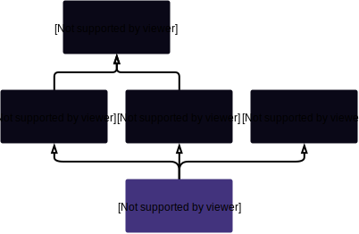
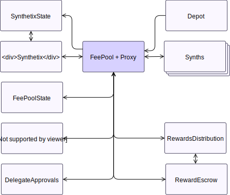

# FeePool

!!! info "Work In Progress"
    This still needs to be cleaned up and the rest of my notes migrated in.

## Description

> Some kind of intro preamble here.

**Old:** FeePool.sol: Understands fee information for Synthetix. As users transact, their fees are kept in 0xfeefeefee... and stored in XDRs. Allows users to claim fees they're entitled to.

A contract for managing and claiming fees. Note that most logic related to of the transfer fee related logic is superfluous, as the transfer fee rate is 0.

> Proxy and State Contracts

Sits behind a proxy.

!!! danger "Admin Function Events"
    Several admin functions should emit events, but they do not. Now that transfer fee logic has been removed, it may be possible to introduce these.

!!! bug "Lingering Debug Events"
    `LogInt` and `LogAddress` events remain in the source code and should be removed as they are unused.

### Exchange Fees

> Exchange fees, the fee pool, and XDRs.

### Inflationary Rewards

> Rewards vs Fees, RewardsDistribution, and SupplySchedule

### Fee Periods

> Fee Periods, issuance and burning

This contract was updated as a part of [SIP-4](https://github.com/Synthetixio/SIPs/blob/master/SIPS/sip-4.md). As the contract requires fees to roll over through the entire fee window before incentive changes are actually felt, the system is a little unresponsive. To combat this, the fee window was reduced from six weeks to three weeks, which reduced the lag time between user action and the rewards actually being withdrawable.

!!! note
    The SIP says that the fee window was reduced to two weeks, but the actual contract code sets it to three.

### Claiming Fees

> The process

> Fee threshold and issuance vs collateralisation ratio.

* SIP-2: Eliminates fee penalty tiers and replaces them with a flat 100% penalty if above a target ratio.

**Source:** [FeePool.sol](https://github.com/Synthetixio/synthetix/blob/master/contracts/FeePool.sol)

<section-sep />

## Architecture

---

### Inheritance Graph

<centered-image>
    
</centered-image>

---

### Related Contracts

<centered-image>
    
</centered-image>

??? example "Details"
    * [`Proxy`](Proxy.md): The fee pool, being [`Proxyable`](Proxyable.md), sits behind a `CALL`-style proxy for upgradeability.
    * [`Synthetix`](Synthetix.md): The fee pool uses the main Synthetix contract to convert between flavours of synths when manipulating fees in XDRs or otherwise, and to retrieve account collateralisation ratios.
    * [`SynthetixState`](SynthetixState.md): The fee pool retrieves the global issuance ratio, and queries the debt ledger directly from the Synthetix state contract.
    * [`Synth`](Synth.md): The fee pool, retrieving their addresses from the Synthetix contract, directly burns and issues synths when transferring fees and converting between flavours. The address of the XDR Synth contract is of particular importance, since fees are denominated in XDRs when they are sitting in the pool, but paid out in a flavour of the user's choice. Synths themselves do not know the fee pool address directly, but ask the fee pool's proxy for its target.
    * [`FeePoolState`](FeePoolState.md): The fee pool state contract holds the details of each user's most recent issuance events: when they issued and burnt synths, and their value.
    * [`FeePoolEternalStorage`](FeePoolEternalStorage): A storage contact that holds the last fee withdrawal time for each account.
    * [`DelegateApprovals`](DelegateApprovals): A storage contract containing addresses to which the right to withdraw fees has been delegated by another account, for example to allow hot wallets to withdraw fees.
    * [`RewardEscrow`](RewardEscrow.md): The contract into which inflationary SNX rewards are paid by the fee pool so that they can be escrowed for a year after being claimed.
    * [`RewardsDistribution`](RewardsDistribution.md): This contract, in the guise of the [`rewardsAuthority`](#rewardsauthority), distributes allocations from the inflationary supply to various recipients.
    * [`Depot`](Depot.md): Allows users to exchange between Synths, SNX, and Ether. The Depot uses the fee pool to know what transfer fees were being incurred on its transfers, although the transfer fee has been nil since before [SIP-19](https://sips.synthetix.io/sips/sip-19).

---

### Libraries

* [SafeMath](SafeMath.md) for uint
* [SafeDecimalMath](SafeDecimalMath.md) for uint

---

<section-sep />

## Structs

---

### `FeePeriod`

A record for a fee period, when it was opened, and the fees and rewards accrued within it. This information is maintained for the last several fee periods in [`recentFeePeriods`](#recentfeeperiods).

Field | Type | Description
------|------|------------
feePeriodId | `uint` | A serial id for fee periods which is incremented for each new fee period.
startingDebtIndex | `uint` | The length of [`SynthetixState.debtLedger`](SynthetixState.md#debtledger) at the time this fee period began.
startTime | `uint` | The current timestamp when this fee period began.
feesToDistribute | `uint` ([18 decimals](SafeDecimalMath.md)) | The total of fees to be distributed in this period, in XDRs. This increases when fees are collected in the current period or when unclaimed fees roll over from the oldest period to the second oldest. See [`feePaid`](#feepaid) and [`closeCurrentPeriod`](#closecurrentperiod).
feesClaimed | `uint` ([18 decimals](SafeDecimalMath.md)) | The number of fees that have already been claimed during this period.
rewardsToDistribute | `uint` ([18 decimals](SafeDecimalMath.md)) | The total of inflationary rewards to be distributed in this period, in SNX. This increases when new rewards are minted by [`Synthetix.mint`](Synthetix.md#mint)/[`rewardsMinted`](#rewardsminted), or when unclaimed rewards roll over from the oldest period to the second oldest ([`closeCurrentPeriod`](#closecurrentperiod)).
rewardsClaimed | `uint` ([18 decimals](SafeDecimalMath.md)) | The quantity of inflationary rewards that have already been claimed during this period.

---

<section-sep />

## Variables

---

### `synthetix`

The main [`Synthetix`](Synthetix.md) contract.

**Type:** `Synthetix public`

---

### `synthetixState`

The associated [`SynthetixState`](SynthetixState.md) contract.

**Type:** `SynthetixState public`

---

### `rewardEscrow`

The [`RewardEscrow`](RewardEscrow.md) instance which holds inflationary rewards.

**Type:** `RewardEscrow public`

---

### `feePoolEternalStorage`

The [`FeePoolEternalStorage`](FeePoolEternalStorage.md) key-value store that holds account last withdrawal times.

**Type:** `FeePoolEternalStorage public`

---

### `exchangeFeeRate`

The fee fraction charged on a currency exchange, between 0 and 0.1.

**Type:** `uint public` ([18 decimals](SafeDecimalMath.md))

---

### `MAX_EXCHANGE_FEE_RATE`

[`exchangeFeeRate`](#exchangefeerate) cannot exceed this. Initialised to 10%.

!!! bug "Missing Bounds Check"
    That [`exchangeFeeRate`](#exchangefeerate) should not exceed this value is not actually checked in the [`setExchangeFeeRate`](#setexchangefeerate) function.

**Type:** `uint constant public` ([18 decimals](SafeDecimalMath.md))

**Value:** 0.1

---

### `rewardsAuthority`

The address with the authority to distribute rewards, which is the [`RewardsDistribution`](RewardsDistribution.md) contract.

**Type:** `address public`

---

### `feePoolState`

The [`FeePoolState`](FeePoolState.md) contract associated with this fee pool, which holds historical issuance data for the last several periods.

**Type:** `FeePoolState public`

---

### `delegates`

The address fo the [`DelegateApprovals`](DelegateApprovals.md) contract, used to allow delegation of fee claims.

**Type:** `DelegateApprovals public`

---

### `FEE_ADDRESS`

The address where fees are pooled as XDRs.

**Type:** `address constant public`

**Value:** [`0xfeEFEEfeefEeFeefEEFEEfEeFeefEEFeeFEEFEeF`](https://etherscan.io/address/0xfeEFEEfeefEeFeefEEFEEfEeFeefEEFeeFEEFEeF)

---

### `FEE_PERIOD_LENGTH`

This is the number of weekly fee periods that are tracked by the smart contracts, hence the length of the [`recentFeePeriods`](#recentfeeperiods) array.

This was reduced from 6 to 3 as part of [SIP-4](https://sips.synthetix.io/sips/sip-4), but note the inconsistency with the corresponding constant in [`FeePoolState`](FeePoolState.md#fee_period_length), which cannot be altered.

**Type:** `uint constant public`

**Value:** `3`

---

### `recentFeePeriods`

Stores [fee period information](#feeperiod) for the last three weeks, from newest to olders.

`recentFeePeriods[0]` is always the current fee period, which is modified by ongoing issuance and fee activity. Fees cannot be claimed from the current period, only from the closed periods at indexes `1` and `2`.

**Type:** `FeePeriod[FEE_PERIOD_LENGTH] public`

---

### `feePeriodDuration`

This is the minimum duration of a single fee period in seconds. In practice they may be slightly longer if [`closeCurrentFeePeriod`](#closecurrentfeeperiod) is not called immediately at the earliest valid moment.

Its value is one week, but it may be between [`MIN_FEE_PERIOD_DURATION`](#min_fee_period_duration) and [`MAX_FEE_PERIOD_DURATION`](#max_fee_period_duration) (1 to 60 days).

**Type:** `uint public`

!!! caution "Erroneous Comment"
    The comment on this variable says `It is required for the fee authority to roll over the periods`, but this is no longer true, as [`closeCurrentFeePeriod`](#closecurrentfeeperiod) is now callable by anyone.

---

### `MIN_FEE_PERIOD_DURATION`

The minimum value of [`feePeriodDuration`](#feeperiodduration).

**Type:** `uint public constant`

**Value:** `1 days`

---

### `MAX_FEE_PERIOD_DURATION`

The maximum value of [`feePeriodDuration`](#feeperiodduration).

**Type:** `uint public constant`

**Value:** `60 days`

---

### `TARGET_THRESHOLD`

A threshold that allows issuers to be undercollateralised by up to 10%. Users may claim fees if their [collateralisation ratio](Synthetix.md#collateralisationratio) is below the target [issuance ratio](SynthetixState.md#issuanceratio) plus 10%.

This is designed to allow users to have a little slack in case prices move quickly.

**Type:** `uint public`

!!! caution "Constant Case"
    Note that this is in CONSTANT_CASE even though it is not a constant. Its value may be changed by the owner calling [`setTargetThreshold`](#settargetthreshold).

!!! danger "Potential System Undercollateralisation"
    At 10%, `TARGET_THRESHOLD` in principle allows the system's total issued value to reach 110% percent of its supposed maximum.
    Moreover, the fact that this quantity is modifiable, and has no constraint on what value it can be changed to means that it could be set, for example, to 500%, and the Synthetix system would become a fractional reserve system.

---

### `LAST_FEE_WITHDRAWAL`

This string is used as part of a key for accessing account withdrawal timestamps from the [eternal storage contract](#feepooleternalstorage).

This is only used within  [`FeePool.getLastFeeWithdrawal`](FeePool.md#getlastfeewithdrawal) and [`FeePool.setLastFeeWithdrawal`](FeePool.md#setlastfeewithdrawal), where it is hashed together with the target address to obtain the correct key.

This must have the same value as [`FeePoolEternalStorage.LAST_FEE_WITHDRAWAL`](FeePoolEternalStorage.md#last_fee_withdrawal).

**Type:** `bytes32 constant`

**Value:** `"last_fee_withdrawal"`

---

<section-sep />

## Functions

---

### `constructor`

This initialises the various state contract addresses the fee pool knows about, along with its inherited [`SelfDestructible`](SelfDestructible.md), [`Proxyable`](Proxyable.md), and [`LimitedSetup`](LimitedSetup.md) instances.

This constructor also begins the first fee period, as it initialises the first fee period id to 1, and the first fee period start time to the construction time.

??? example "Details"
    **Signature**

    `constructor(address _proxy, address _owner, Synthetix _synthetix, FeePoolState _feePoolState, FeePoolEternalStorage _feePoolEternalStorage, ISynthetixState _synthetixState, ISynthetixEscrow _rewardEscrow, address _rewardsAuthority, uint _exchangeFeeRate) public`

    **Superconstructors**

    * [`Proxyable(_proxy, _owner)`](Proxyable.md#constructor)
    * [`SelfDestructible(_owner)`](SelfDestructible.md#constructor)
    * [`LimitedSetup(3 weeks)`](LimitedSetup.md#constructor)
    
    **Preconditions**

    * `_exchangeFeeRate` must be no greater than [`MAX_EXCHANGE_FEE_RATE`](#max_exchange_fee_rate).

---

### `appendAccountIssuanceRecord`

Records that an account issued or burnt synths in the fee pool state.

This function merely emits an event and passes through to [`FeePoolState.appendAccountIssuanceRecord`](FeePoolState.md#appendAccountIssuanceRecord) and is itself only invoked by [`Synthetix._appendAccountIssuanceRecord`](Synthetix.md#_appendaccountissuancerecord).

The `debtRatio` argument is a [27-decimal fixed point number](SafeDecimalMath.md).

??? example "Details"
    **Signature**

    `appendAccountIssuanceRecord(address account, uint debtRatio, uint debtEntryIndex) external`

    **Modifiers**

    * [`onlySynthetix`](#onlysynthetix)

    **Emits**

    * [`IssuanceDebtRatioEntry(account, debtRatio, debtEntryIndex, recentFeePeriods[0].startingDebtIndex)`](#issuancedebtratioentry)

---

### `setExchangeFeeRate`

Allows the contract owner to set the [exchange fee rate](#exchangefeerate).

!!! bug "Missing Bounds Check"
    The docstring implies that the exchange fee rate cannot exceed 10%, but this is not checked in the function.

??? example "Details"
    **Signature**

    `setExchangeFeeRate(uint _exchangeFeeRate) external`

    **Modifiers**

    * [`Proxyable.optionalProxy_onlyOwner`](Proxyable.md#optionalproxy_onlyowner)

---

### `setRewardsAuthority`

Allows the contract owner to set the [rewards authority](#rewardsauthority).

??? example "Details"
    **Signature**

    `setRewardsAuthority(address _rewardsAuthority) external`

    **Modifiers**

    * [`Proxyable.optionalProxy_onlyOwner`](Proxyable.md#optionalproxy_onlyowner)

---

### `setFeePoolState`

Allows the contract owner to set the [`feePoolState`](#feepoolstate) contract address.

??? example "Details"
    **Signature**

    `setFeePoolState(FeePoolState, _feePoolState) external`

    **Modifiers**

    * [`Proxyable.optionalProxy_onlyOwner`](Proxyable.md#optionalproxy_onlyowner)

---

### `setDelegateApprovals`

Allows the contract owner to set the [`DelegateApprovals`](#delegates) contract address.

??? example "Details"
    **Signature**

    `setDelegateApprovals(DelegateApprovals _delegates) external`

    **Modifiers**

    * [`Proxyable.optionalProxy_onlyOwner`](Proxyable.md#optionalproxy_onlyowner)

---

### `setFeePeriodDuration`

Allows the contract owner to set the [fee period duration](#feeperiodduration).

??? example "Details"
    **Signature**

    `setFeePeriodDuration(uint _feePeriodDuration) external`

    **Modifiers**

    * [`Proxyable.optionalProxy_onlyOwner`](Proxyable.md#optionalproxy_onlyowner)

    **Preconditions**

    * `_feePeriodDuration` must be no less than [`MIN_FEE_PERIOD_DURATION`](#min_fee_period_duration).
    * `_feePeriodDuration` must be no greater than [`MAX_FEE_PERIOD_DURATION`](#max_fee_period_duration).

---

### `setSynthetix`

Allows the contract owner to set the [`Synthetix` contract address](#synthetix).

??? example "Details"
    **Signature**

    `setSynthetix(Synthetix _synthetix) external`

    **Modifiers**

    * [`Proxyable.optionalProxy_onlyOwner`](Proxyable.md#optionalproxy_onlyowner)

    **Preconditions**

    * `_synthetix` must not be the zero address.

---

### `setTargetThreshold`

Allows the contract owner to set the [collateralisation ratio target threshold](#target_threshold).

The function requires its input as an integral percentage point value, rather than as a fractional number. So in order to set [`TARGET_THRESHOLD`](#target_threshold) to 0.05, provide the argument `5`. There is no way of setting a threshold between whole number percentages.

!!! bug "Missing Bounds Check"
    This function does not constrain the input value. See the notes on the [`TARGET_THRESHOLD`](#target_threshold) for consequences of this if the owner chooses to set this to something large.

??? example "Details"
    **Signature**

    `setTargetThreshold(uint _percent) external`

    **Modifiers**

    * [`Proxyable.optionalProxy_onlyOwner`](Proxyable.md#optionalproxy_onlyowner)

    **Preconditions**

    * `_percent` must not be negative.

    !!! info "A Minor Inelegance"
        Note that this checks that a uint is non-negative. This check should be removed as it serves no purpose.

---

### `feePaid`

Allows the [`Synthetix._internalExchange`](Synthetix.md#_internalexchange) function to record that a fee was paid whenever an exchange between Synth flavours occurs.

Converts `amount` from `currencyKey` to a value in XDRs (if required) and then adds the value to the current period's pot of fees to be distributed.

???+ info "A Minor Note on Efficiency"
    This could be more efficient if this function only accepted values already converted to XDRs. `feePaid` throws away `currencyKey`, only using it for calling back to Synthetix to find the equivalent XDR value at current exchange rates.

    Further, the Synthetix contract already pre-computes the XDR value before passing it to the FeePool contract anyway, so the branch that actually converts the value can never be reached.

??? example "Details"
    **Signature**

    `feePaid(bytes32 currencyKey, uint amount) external`

    !!! caution "Naming"
        Be aware that although the name reads like it could be a predicate, this is actually an effectful function.

    **Modifiers**

    * [`onlySynthetix`](#onlysynthetix)

---

### `setRewardsToDistribute`

Adds a quantity of SNX to the current fee period's total of rewards to be distributed.

!!! caution "Potentially-Misleading Name"
    Although the name might imply otherwise, this function can't reduce or reset the amount of funds to be distributed, but only add to the existing pot.

??? example "Details"
    **Signature**

    `setRewardsToDistribute(uint amount) external`

    **Preconditions**

    * Either `msg.sender` or [`messageSender`](Proxyable.md#messagesender) must be the [rewards authority address](#rewardsauthority).

---

### `closeCurrentFeePeriod`

If the current fee period has been open for longer than [`feePeriodDuration`](#feeperiodduration), then anyone may call this function to close it and open a new one.

The new fee period is added to the beginning of the [`recentFeePeriods`](#recentfeeperiods) list, and the last one is discarded. Any unclaimed fees from the last fee period roll over into the penultimate fee period.

The new fee period's [`feePeriodId`](#feeperiod) is the previous id incremented by 1, and its [`startingDebtIndex`](#feeperiod) is the length of [`SynthetixState.debtLedger`](SynthetixState.md#debtledger) at the time the fee period rolls over. Note that before a new minting event occurs this index will be one past the end of the ledger.

!!! caution "Erroneous Comment"
    A comment at the end of this function says `Take a snapshot of the total value of the system.`, but no such snapshot is explicitly taken. Rather, the relative movements of the system's valuation is recorded at every minting event in the system [debt ledger](SynthetixState.md#debtledger).

??? example "Details"
    **Signature**

    `closeCurrentFeePeriod() external`

    **Preconditions**

    * the start time of the current fee period must have been at least [`feePeriodDuration`](#feeperiodduration) seconds in the past.

    **Emits**

    * [`FeePeriodClosed(closedFeePeriodId)`](#feeperiodclosed)

---

### `claimFees`

The message sender claims their fees in the currency specified.

This is equivalent to [`_claimFees(messageSender, currencyKey)`](#_claimfees).

??? example "Details"
    **Signature**

    `claimFees(bytes32 currencyKey) external returns (bool)`

    **Modifiers**

    * [`Proxyable.optionalProxy`](Proxyable.md#optionalproxy)

---

### `claimOnBehalf`

The message sender claims fees in a given currency for a specified address; the funds are remitted to that address, and not to the sender.

This function first checks with the [`DelegateApprovals`](DelegateApprovals.md) contract that the sender is approved to claim fees on behalf of the specified address, but is otherwise equivalent to [`_claimFees(claimingForAddress, currencyKey)`](#_claimfees).

??? example "Details"
    **Signature**

    `claimOnBehalf(address claimingForAddress, bytes32 currencyKey) external returns (bool)`

    **Modifiers**

    * [`Proxyable.optionalProxy`](Proxyable.md#optionalproxy)

    **Preconditions**

    * `messageSender` must be [an approved delegate](DelegateApprovals.md#approval) of `claimingForAddress`.

---

### `_claimFees`

Claims fees and rewards owed to the specified address.

The account's collateralisation ratio must be less than the [issuance ratio](SynthetixState.md#issuanceratio), plus the [target threshold](#target_threshold), as specified by the [`feesClaimable`](#feesclaimable) function. The quantity of fees and rewards owed is computed by [`feesAvailable`](#feesavailable).

Upon invocation, this function updates the account's [last fee withdrawal time](#_setlastfeewithdrawal), and removes the claimed [fees](#_recordFeePayment) and [rewards](#_recordRewardPayment) from the pool.
Fees are paid into the claiming address [in the specified currency](#_payFees), while the rewards are [escrowed](#_payRewards) on behalf of the claiming address in the [`RewardEscrow`](#rewardescrow) contract for one year.

The return value is always true if the transaction was not reverted.

!!! bug "Potential Overclaiming"
    If a user last issued SNX earlier than the last recent fee period, they may be paid out too many fees/rewards. See [`feesAvailable`](#feesavailable) and [`feesByPeriod`](#feesbyperiod) for details.

??? example "Details"
    **Signature**

    `_claimFees(address claimingAddress, bytes32 currencyKey) internal returns (bool)`

    **Preconditions**

    * The user's [collateralisation ratio](Synthetix.md#collateralisationratio) must be below the threshold, as per [`feesClaimable`](#feesclaimable).
    * The user must have a positive value of fees or rewards available to claim.

    **Emits**

    * [`FeesClaimed(claimingAddress, feesPaid, rewardsPaid)`](#feesclaimed) (`feesPaid` is denominated in XDRs, `rewardsPaid` in SNX)

---

### `recoverTransferFees`

This function allowed the contract owner to recover leftover transfer fees from a previous version, which were otherwise unrecoverable. It simply converts any sUSD at the [fee address](#fee_address) into XDRs.

See [SIP-18](https://sips.synthetix.io/sips/sip-18) for details.

??? example "Details"
    **Signature**

    `recoverTransferFees() public`

    **Modifiers**

    * [`Proxyable.optionalProxy_onlyOwner`](Proxyable.md#optionalproxy_onlyowner)
    * [`LimitedSetup.onlyDuringSetup`](LimitedSetup.md#onlyduringsetup)

    **Preconditions**

    * There must be a positive quantity of sUSD at the [fee address](#fee_address).

---

### `importFeePeriod`

During the setup period, allowed the contract owner to set a particular fee period entry in [`recentFeePeriods`](#recentfeeperiods) in order to migrate from a previous contract version.

??? example "Details"
    **Signature**

    `importFeePeriod(uint feePeriodIndex, uint feePeriodId, uint startingDebtIndex, uint startTime, uint feesToDistribute, uint feesClaimed, uint rewardsToDistribute, uint rewardsClaimed) public`

    **Modifiers**

    * [`Proxyable.optionalProxy_onlyOwner`](Proxyable.md#optionalproxy_onlyowner)
    * [`LimitedSetup.onlyDuringSetup`](LimitedSetup.md#onlyduringsetup)

---

### `appendVestingEntry`

Allows the contract owner to escrow SNX rewards for particular accounts. The rewards are escrowed for one year.

The SNX is deposited into the [`RewardEscrow`](RewardEscrow.md) contract from the sender using the ERC20 transferFrom function. The tokens are then escrowed on behalf of the targeted account with [`RewardEscrow.appendVestingEntry`](RewardEscrow.md#appendvestingentry).

??? example "Details"
    **Signature**

    `appendVestingEntry(address account, uint quantity) public`

    **Modifiers**

    * [`Proxyable.optionalProxy_onlyOwner`](Proxyable.md#optionalproxy_onlyowner)

---

### `approveClaimOnBehalf`

Approves an account as a fee claimant for the sender in the [`DelegateApprovals`](DelegateApprovals.md#setapproval) contract.

??? example "Details"
    **Signature**

    `approveClaimOnBehalf(address account) public`

    **Modifiers**

    * [`Proxyable.optionalProxy`](Proxyable.md#optionalproxy)

    **Preconditions**

    * The [`delegates`](#delegates) address must not be zero.
    * `account` must not be zero.

    !!! info "Redundant Conditions"
        Neither of the preconditions is actually necessary.

---

### `removeClaimOnBehalf`

Disapproves an account as a fee claimant for the sender in the [`DelegateApprovals`](DelegateApprovals.md#withdrawapproval) contract.

??? example "Details"
    **Signature**

    `removeClaimOnBehalf(address account) public`

    **Modifiers**

    * [`Proxyable.optionalProxy`](Proxyable.md#optionalproxy)

    **Preconditions**

    * The [`delegates`](#delegates) address must not be zero.

    !!! info "Redundant Precondition"
        The precondition is unnecessary.

---

### `_recordFeePayment`

Claims a quantity of fees from the [recent fee periods](#recentfeeperiods).

Fees are deducted from each [period's unclaimed fees](#feeperiod) in turn from the oldest to the most recent closed period as each is exhausted until either the entire quantity has been met, or the current fee period is reached.

As fees are not paid out from the current period, if there is any quantity left to be paid after all closed periods have been exhausted, it is simply ignored. Hence any losses due to rounding errors come out of the claim of the last person to claim. The function returns the quantity of fees actually claimed, which may be less than `xdrAmount` in this case.

This is only called in `_claimFees`.

In pseudo-code:

```python
remaining = xdrAmount # The quantity to pay out.
paid = 0 # The quantity actually paid.

# Pay out fees from recent periods, from oldest to newest as they are exhausted.
# Don't traverse the current fee period.
for each closed period in reversed(recentFeePeriods):
    unclaimedFees = period.feesClaimed - period.feesToDistribute
    # Skip to the next period if this one is exhausted.
    if unclaimedFees == 0:
        continue

    # Don't pay out too much.
    payable = min(unclaimedFees, remaining)

    paid += payable
    period.feesClaimed += payable
    remaining -= payable

return paid
```

!!! note
    The final lines of the loop body, `if (i == 0 && remainingToAllocate > 0) { remainingToAllocate = 0; }` are redundant. One could just iterate once less. There might be another minor efficiency dividend to be had by not fetching `feesClaimed` from the state twice.

??? example "Details"
    **Signature**

    `_recordFeePayment(uint xdrAmount) internal returns (uint)`:

---

### `_recordRewardPayment`

Claims a quantity of SNX rewards from the [recent fee periods](#recentfeeperiods). This is only called in `_claimFees`.

Its logic is identical to [`_recordFeePayment`](#_recordfeepayment), except that the relevant quantities are in `SNX`, and are claimed from [`rewardsClaimed`](#feeperiod).

??? example "Details"
    **Signature**

    `_recordRewardPayment(uint snxAmount) internal returns (uint)`:

---

### `_payFees`

Pays a quantity of fees in a desired Synth flavour to a claiming address.

The quantity is specified in XDRs, which is burnt from the fee pool, and an [equivalent value](Synthetix.md#effectivevalue) in the desired flavour is issued into the destination address.

The ERC223 token fallback is triggered on the recipient address if it implements one.

!!! note "A Minor Infficiency"
    Some gas could be saved by keeping the address of the XDR synth as a variable rather than retrieving it with [`Synthetix.synths("XDR")`](Synthetix.md#synths) each invocation.

??? example "Details"
    **Signature**

    `_payFees(address account, uint xdrAmount, bytes32 destinationCurrencyKey) internal`

    **Modifiers**

    * [`notFeeAddress(account)`](#notfeeaddress)

    **Preconditions**

    * `account` can't be the fee address.
    * `account` can't be 0.
    * `account` can't be the FeePool contract itself.
    * `account` can't be the fee pool's proxy.
    * `account` can't be the Synthetix contract.

---

### `_payRewards`

Pays a quantity of rewards to a specified address, escrowing it for one year with [`RewardEscrow.appendVestingEntry`](RewardEscrow.md#appendvestingentry).

??? example "Details"
    **Signature**

    `_payRewards(address account, uint snxAmount) internal`

    **Modifiers**

    * [`notFeeAddress(account)`](#notfeeaddress)

    **Preconditions**

    * `account` can't be the fee address.
    * `account` can't be 0.
    * `account` can't be the FeePool contract itself.
    * `account` can't be the fee pool's proxy.
    * `account` can't be the Synthetix contract.

---

### `amountReceivedFromTransfer`

Computes the number of Synths received by the recipient if a certain quantity is sent.

As of [SIP-19](https://sips.synthetix.io/sips/sip-19), this is just the identity function, since there are no longer any transfer fees. It is only used by the [`Depot`](Depot.md) contract.

??? example "Details"
    **Signature**

    `amountReceivedFromTransfer(uint value) external view returns (uint)`

---

### `exchangeFeeIncurred`

Returns the fee charged on an exchange of a certain quantity of Synths into another flavour. This is simply the input multiplied by [`exchangeFeeRate`](#exchangeFeeRate).

??? example "Details"
    **Signature**

    `exchangeFeeIncurred(uint value) public view returns (uint)`

---

### `amountReceivedFromExchange`

Computes the quantity received if a quantity of Synths is exchanged into another flavour. The amount received is the quantity sent minus the [exchange fee](#exchangefeeincurred), as per the logic in [`Synthetix._internalExchange`](Synthetix.md#_internalexchange).

??? example "Details"
    **Signature**

    `amountReceivedFromExchange(uint value) external view returns (uint)`

---

### `totalFeesAvailable`

Computes the total fees available to be withdrawn, valued in terms of `currencyKey`. This simply sums the unclaimed fees over [`recentFeePeriods`](#recentfeeperiods) except those from the current period, because they cannot yet be claimed.

??? example "Details"
    **Signature**

    `totalFeesAvailable(bytes32 currencyKey) external view returns (uint)`

---

### `totalRewardsAvailable`

Computes the total SNX rewards available to be withdrawn. This simply sums the unclaimed rewards over [`recentFeePeriods`](#recentfeeperiods) except those from the current period, because they cannot yet be claimed.

??? example "Details"
    **Signature**

    `totalRewardsAvailable() external view returns (uint)`

---

### `feesAvailable`

Return the total of fees and rewards available to be withdrawn by this account. The result is reported as a `[fees, rewards]` pair denominated in the requested Synth flavour and SNX, respectively.

This is the total of fees accrued in completed periods, so is simply the the sum over an account's [`feesByPeriod`](#feesbyperiod) not including the current period.

!!! bug "Overlapping Applicable Issuance Events Could Overreport Fees"
    This is just a naive sum over the result reported by [`feesByPeriod`](#feesbyperiod). If the last time a user issued occurred before the beginning of the last-tracked fee period, a user could claim more fees that they are actually owed. Check the `feesByPeriod` notes for details.

!!! caution "Ambiguous Naming"
    Don't confuse this funciton with [`feesClaimable`](#feesclaimable).

??? example "Details"
    **Signature**

    `feesAvailable(address account, bytes32 currencyKey) public view returns (uint, uint)` 

---

### `feesClaimable`

This is a predicate, returning true iff a particular account is permitted to claim any fees it has accrued.

A account is able to claim fees if its [collateralisation ratio](Synthetix.md#collateralisationratio) is less than 110% of the [global issuance ratio](SynthetixState.md#issuanceratio).

!!! danger "Potential System Undercollateralisation"
    The logic allows fees to be withdrawn if an account's ratio is less than [`SynthetixState.issuanceRatio *`](SynthetixState.md#issuanceRatio) [`(1 + TARGET_THRESHOLD)`](#target_threshold).

    The same result could be met by just adjusting the issuance ratio, except that the target threshold in this version of the system does not have any of the bounds checking that exists on the issuance ratio's value. This allows the issuance ratio to be set to any value.

!!! caution "Potentially Ambiguous Naming"
    This function is a predicate, although its name sounds like it could be returning a quantity of fees claimable, which is actually the [`feesAvailable`](#feesavailable) function.

??? example "Details"
    **Signature**

    `feesClaimable(address account) public view returns (bool)`

---

### `feesByPeriod`

Returns an array of [`FEE_PERIOD_LENGTH`](#fee_period_length) `[fees, rewards]` pairs owed to an account for each [recent fee period](#recentfeeperiods) (including the current one). Fees are denominated in XDRs and rewards in SNX.

To compute this, for each period from oldest to newest, find the [latest issuance event this account performed before the close of this period](FeePoolState.md#applicableissuancedata), and use it to derive the owed [fees and rewards](#_feesandrewardsfromperiod) for that period.

Periods where the user has already withdrawn since that period closed are skipped, producing `[0,0]` entries.

!!! bug "Zero Fees Remaining Check"
    The guard `if (synthetix.totalIssuedSynths("XDR") == 0) return;` is a bit strange.

    XDRs existing seems to be a necessary condition for a user to have nonzero ownership percentages, so this check looks redundant.

    Not sure if the fee pool ever actually empties out, but in any case it doesn't account for the case where there is a positive but too-low quantity of fees remaining. In any case, it will report zero for all periods if there are no fees in the pool, but if there is a sudden infusion of fees then their fees owed increases. It's probably more informative for the user if they can see what their potential fee claim is even if there are no fees to be claimed, so that they can tell if they should wait for the pot to fill up or not.

    Additionally, it only checks for fees and not for rewards, which means that cases where there are rewards left but no fees will be incorrectly skipped.

    So one of two options could be appropriate. Either: remove the check; or clamp the fees owed to the quantity left in the pot, accounting for rewards as well as fees, which subsumes the existing behaviour in a more-consistent structure.

!!! bug "Overlapping Applicable Issuance Data"
    The fee pool stores information about the last three fee periods, 0, 1, 2. If a user's last issuance event occurred in period 3, for example, then it is applicable for all three known recent fee periods. This means that the fees and rewards owed will be duplicated in all following periods. That is, although they should only be owed fees in period 2, it will report that they are owed fees in each of periods 0 and 1 as well.

    Additionally, resolving this probably means not handling the current fee period as a separate case. The code is probably clearer if the latest fee period is just treated the same as everything else anyway.

!!! danger "Closing Debt Index Comments"
    The latter two thirds of the comment on the `closingDebtIndex` declaration seems to be out of date? `issuanceData[0]` is never explicitly fetched within the loop, only `feePoolState.applicableIssuanceData` is actually used.

    The gas optimisation comments should be removed and/or implemented, though keeping the most recent entry doesn't make a lot of sense if no applicable issuance event was found.

!!! caution "Initialisation Check Comment"
    In most circumstances, the guard `nextPeriod.startingDebtIndex > 0` cannot fail to be true unless the current period is 0, but this is disallowed by the loop condition.

    This matters during the initial deployed period before the [`recentFeePeriods`](#recentfeeperiods) array has been populated. It might be worth leaving a comment clarifying this.

!!! info "Optimisation: Broaden Debt Entry Initialisation Check"
    The check `if (debtEntryIndex == 0 && userOwnershipPercentage == 0) return;` only checks if this user has no debt entries at all. First, `debtEntryIndex == 0` implies `userOwnershipPercentage == 0`. Second, they may have a zero debt ownership percentage, but still have a nonzero debt entry index if at some point they burnt all Synths. In this case the function body can still be skipped. So it is sufficient to check for `userOwnershipPercentage == 0`.

!!! info "Optimisation: Move Initialisation Check Inside Conditional"
    The check that `nextPeriod.startingDebtIndex > 0` can be skipped if the last fee withdrawal time was already too recent by moving it into its own nested conditional.

!!! info "Optimisation: Hoist Function Call"
    The return value of `getLastFeeWithdrawal(account)` does not change between iterations, thus this call can be hoisted out of the loop, saving some inter-contract call overhead.

??? example "Details"
    **Signature**

    `feesByPeriod(address account) public view returns (uint[2][FEE_PERIOD_LENGTH] memory results)`

---

### `_feesAndRewardsFromPeriod`

Computes the fees (in XDRs) and rewards (in SNX) owed at the end of a recent fee period given an entry index and the percentage of total system debt owned.

* `period` is an index into the [`recentFeePeriods`](#recentfeeperiods) array, thus 0 corresponds with the current period.
* `debtEntryIndex` should be an index into the debt ledger which was added before the close of the specified fee period.
* `ownershipPercentage` should be the percentage of the account's debt ownership at that `debtEntryIndex`. This is a [27-decimal fixed point number](SafeDecimalMath.md).

!!! bug "Current Period Ownership Percentage Movement"
    This uses [`_effectiveDebtRatioForPeriod`](#_effectivedebtratioforperiod) to account for ownership movements, unless we are considering the current period. This means that the reported fees owing for the current period is inaccurate until the fee period closes. In case of the current period, this should perhaps use the latest entry in the debt ledger to compute the adjustment given that there is no closing index.

??? example "Details"
    **Signature**

    `_feesAndRewardsFromPeriod(uint period, uint ownershipPercentage, uint debtEntryIndex) internal returns (uint, uint)`

---

### `_effectiveDebtRatioForPeriod`

Given entry and exit indices into the debt ledger, and a percentage of total debt ownership at the entry index, this function computes the adjusted ownership percentage at the exit index. This percentage changes due to fluctuations in Synth prices and total supply.

If $\Delta_i$ is the value of the $i^{th}$ entry in the [debt ledger](SynthetixState.md#debtledger) and $\omega$ is the provided debt ownership percentage, then the result of this function is:

$$
\omega \frac{\Delta_\text{exit}}{\Delta_\text{entry}}
$$

See [`Synthetix._addToDebtRegister`](Synthetix.md#_addToDebtRegister) for details of the debt ownership percentage adjustment.

!!! caution "Superfluous Check"
    This returns 0 if `closingDebtIndex` is strictly greater than the [length of the debt ledger](SynthetixState.md#debtledgerlength).

    This condition can never be satisfied except in case of a bug, but even if it could be satisfied, the corresponding entry would still return 0 anyway, since the debt ledger grows monotonically.

!!! bug "Edge Case: Array Index Out of Bounds"
    The length guard includes an off-by-one error, as the condition should be `closingDebtIndex >= synthetixState.debtLedgerLength()`.

    If `closingDebtIndex` equals [`SynthetixState.debtLedgerLength()`](SynthetixState.md#debtledgerlength), then this function will fetch the [`SynthetixState.debtLedger`](SynthetixState.md#debtledger) element one past the end, which will produce 0. Consequently the function will return 0 even if it should not.

    It is unlikely this case can be evinced in practice given the above note on the superfluity of the check.

??? example "Details"
    **Signature**

    `_effectiveDebtRatioForPeriod(uint closingDebtIndex, uint ownershipPercentage, uint debtEntryIndex) internal view returns (uint)`

---

### `effectiveDebtRatioForPeriod`

Given an account and an index into [`recentFeePeriods`](#recentfeeperiods), this function computes the percentage of total debt ownership of the account at the end of that period.

This uses [`_effectiveDebtRatioForPeriod`](#_effectiveDebtRatioForPeriod), where the start index and ownership percentage are computed with [`FeePoolState.applicableIssuanceData`](FeePoolState.md#applicableissuancedata), and the end index is one before the beginnging of the next period. Hence this function disallows querying the debt for the current period.

In principle a future version could support the current fee period by using the last debt ledger entry as the end index.

!!! Bug "Todo: Investigate the consequences of an old start index"
    If the start index occurs earlier than the beginning of several fee periods, then can the debt ratio computations not correspond to overlapping periods?

!!! caution "Potentially Misleading Comment"
    The following lines could be read to imply that each period's debt index begins at zero.

    ```
    // No debt minted during period as next period starts at 0
    if (recentFeePeriods[period - 1].startingDebtIndex == 0) return;
    ```

    In fact, this check can only be triggered if no debt has been minted at all, as it implies (in combination with the preconditions on the period number) that the fee period is uninitialised. This is only an issue before enough fee periods have completed to fill up [`recentFeePeriods`](#recentfeeperiods).

??? example "Details"
    **Signature**

    `effectiveDebtRatioForPeriod(address account, uint period) external view returns (uint)`

    **Preconditions**

    * `period` must not be 0, as the current fee period has not closed.
    * `period` must not exceed [`FEE_PERIOD_LENGTH`](#fee_period_length).

---

### `getLastFeeWithdrawal`

Returns from [`FeePoolEternalStorage`](FeePoolEternalStorage.md) the id of the fee period during which the given address last withdrew fees.

??? example "Details"
    **Signature**

    `getLastFeeWithdrawal(address _claimingAddress) public view returns (uint)`

---

### `getPenaltyThresholdRatio`

Returns the collateralisation level a user can reach before they cannot claim fees. This is simply [`SynthetixState.issuanceRatio *`](SynthetixState.md#issuanceratio) [`(1 + TARGET_THRESHOLD)`](#target_threshold). The result is returned as a [18-decimal fixed point number](SafeDecimalMath.md).

!!! caution "A Minor Inefficiency"
    The address of [`SynthetixState`](SynthetixState.md) is computed with the indirection [`Synthetix.synthetixState`](Synthetix.md#synthetixstate), but the fee pool contract already has a copy of the address in its own [`synthetixState`](#synthetixstate) variable.

??? example "Details"
    **Signature**

    `getPenaltyThresholdRatio() public view returns (uint)`

---

### `_setLastFeeWithdrawal`

Stores into [FeePoolEternalStorage](FeePoolEternalStorage.md) the id of the fee period during which this address last withdrew fees.

??? example "Details"
    **Signature**

    `_setLastFeeWithdrawal(address _claimingAddress, uint _feePeriodID) internal`

---

<section-sep />

## Modifiers

---

### `onlySynthetix`

Reverts the transaction if `msg.sender` is not the [`synthetix`](#synthetix) address.

---

### `notFeeAddress`

Reverts the transaction if `account` is the [fee address](#fee_address).

**Signature:** `notFeeAddress(address account)`

---

<section-sep />

## Events

---

### `IssuanceDebtRatioEntry`

Records that a new account issuance record was [appended](#appendaccountissuancerecord) to the account's issuance ledger in [`FeePoolState`](FeePoolState.md#appendaccountissuancerecord).

This event is emitted from the FeePool's [proxy](Proxy.md#_emit) with the `emitIssuanceDebtRatioEntry` function.

**Signature:** `IssuanceDebtRatioEntry(address indexed account, uint debtRatio, uint debtEntryIndex, uint feePeriodStartingDebtIndex)`

---

### `ExchangeFeeUpdated`

Records that the fee for exchanging between Synths was [updated](#setexchangefee).

This event is emitted from the FeePool's [proxy](Proxy.md#_emit) with the `emitExchangeFeeUpdated` function.

**Signature:** `ExchangeFeeUpdated(uint newFeeRate)`

---

### `FeePeriodDurationUpdated`

Records that the duration of a single fee period was [updated](#setfeeperiodduration).

This event is emitted from the FeePool's [proxy](Proxy.md#_emit) with the `emitFeePeriodDurationUpdated` function.

**Signature:** `FeePeriodDurationUpdated(uint newFeePeriodDuration)`

---

### `FeePeriodClosed`

Records that a fee period was [closed](#closecurrentfeeperiod), with the id of the closed period.

This event is emitted from the FeePool's [proxy](Proxy.md#_emit) with the `emitFeePeriodClosed` function.

**Signature:** `FeePeriodClosed(uint feePeriodId)`

---

### `FeesClaimed`

Records that an account [claimed](#_claimfees) the fees and rewards owed to them.

This event is emitted from the FeePool's [proxy](Proxy.md#_emit) with the `emitFeesClaimed` function.

**Signature:** `FeesClaimed(address account, uint xdrAmount, uint snxRewards)`

---

<section-sep />
