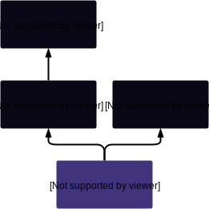

# FeePoolState

## Description

This contract composes persistent state storage for the issuance percentage and index for each address interacting with the fee pool. These details are stored for the last six fee periods.

As a persistent state contract, FeePoolState is not intended to be easily upgraded, as opposed to the [`FeePool`](FeePool.md) itself, which *is* so intended.

See [`FeePool.feesByPeriod`](FeePool.md#feesbyperiod) and [`FeePool.effectiveDebtRatioForPeriod`](FeePool.md#effectivedebtratioforperiod) for discussion of the meaning of this information held in this contract and how it is used.

!!! caution "Caution: The Number of Stored Fee Periods"
    Note that this contract contains storage for [up to six fee periods](#fee_period_length), while the FeePool contract limits it to [only three](FeePool.md#fee_period_length). This is a consequence of the implementation of [SIP 4](https://sips.synthetix.io/sips/sip-4), which reduced the fee window in the main [`FeePool`](FeePool.md) contract in order to encourage faster responses to alterations of system incentives. As part of this process, this storage contract was, of course, not upgraded.

    See also: [Design_Decisions.md](https://github.com/Synthetixio/synthetix/blob/master/Design_Decisions.md#feepoolstate).

**Source:** [FeePoolState.sol](https://github.com/Synthetixio/synthetix/blob/master/contracts/FeePoolState.sol)

## Architecture

---

### Inheritance Graph

<centered-image>
    
</centered-image>

!!! caution "No Relation To The State Contract"
    Although this contract is called FeePoolState, be aware that it does not inherit from the [`State`](State.md) contract.

---

### Related Contracts

* <>[FeePool](FeePool.md)

---

### Libraries

* [`SafeDecimalMath`](SafeDecimalMath.md) for `uint`
* [`SafeMath`](SafeMath.md) for `uint`

---

## Structs

---

### `IssuanceData`

Holds the issuance state and index of users interacting with the [`FeePool`](FeePool.md) for the last [several fee periods](#fee_period_length).

**Fields**

Field | Type | Description
------|------|------------
debtPercentage | `uint` | The percentage of the total system debt owned by the address associated with this entry at the time of issuance. These are [27-decimal fixed point numbers](SafeDecimalMath.md), closely related to the values in [`SynthetixState.debtLedger`](SynthetixState.md#debtledger).
debtEntryIndex | `uint` | The [debt ledger](SynthetixState.md#debtledger) index when this user issued or destroyed tokens. That is, the length of the ledger at the time of issuance.

For more information on these fields and their meaning, see the main [`Synthetix`](Synthetix.md) contract functions [`_addToDebtRegister`](Synthetix.md#_addtodebtregister) and [`_removeFromDebtRegister`](Synthetix.md#_removefromdebtregister), along with the corresponding struct in [`SynthetixState`](SynthetixState.md#issuancedata).

!!! info "Relationship with `SynthetixState`"
    This is the same struct as [`SynthetixState.issuanceData`](SynthetixState.md#issuancedata), modulo naming, but in the case of SynthetixState, only one entry is kept, corresponding to only the most recent issuance event associated with an address.

    This induces a slightly awkward structure where the current and historical issuance information is stored over two separate contracts. In a future version this information could potentially be stored in a unified structure for dividends in efficiency and clarity.

---

## Variables

---

### `FEE_PERIOD_LENGTH`

The number of fee periods (6) worth of issuance data to keep. Note the inconsistency with the corresponding constant in [`FeePool`](FeePool.md#fee_period_length), which is set to 3.

**Type:** `uint8 constant public`

**Value:** `6`

---

### `feePool`

The address of the main [`FeePool`](FeePool.md) contract.

**Type:** `address public`

---

### `accountIssuanceLedger`

A list of up to 6 [issuance data](#issuancedata) entries for each address, for the most recent changes to their issuance level. The fee periods do not have to be consecutive, but they are ordered from newest to oldest (decreasing debt ledger indexes).

Note that the entry `accountIssuanceLedger[account][0]` only corresponds to the current fee period if [`appendAccountIssuanceRecord(account, *, *, *)`](#appendaccountissuancerecord) has been called during the current fee period. That is, if the account has issued or burnt synths this period.

**Type:** `mapping(address => IssuanceData[FEE_PERIOD_LENGTH]) public`

---

## Functions

---

### `constructor`

Initialises the fee pool address, as well as the inherited [`SelfDestructible`](SelfDestructible.md) and [`LimitedSetup`](LimitedSetup.md) instances. The setup period is initialised to six weeks.

??? example "Details"

    **Signature**
    
    `constructor(address _owner, FeePool _feepool) public`

    **Superconstructors**

    * [`SelfDestructible(_owner)`](SelfDestructible.md#constructor)
    * [`LimitedSetup(6 weeks)`](LimitedSetup.md#constructor)

---

### `setFeePool`

Changes the [fee pool address](#feepool).

??? example "Details"

    **Signature**
    
    `setFeePool(FeePool _feePool) external`

    **Modifiers**

    * [`Owned.onlyOwner`](Owned.md#onlyowner)

---

### `getAccountsDebtEntry`

Accesses [`accountIssuanceLedger`](#accountissuanceledger).

The first return value is a [27-decimal fixed point number](SafeDecimalMath.md).

??? example "Details"
    **Signature**

    `getAccountsDebtEntry(address account, uint index) public view returns (uint debtPercentage, uint debtEntryIndex)`

    **Preconditions**

    * Transaction reverts if `index` is not less than [`FEE_PERIOD_LENGTH`](#fee_period_length).

---

### `applicableIssuanceData`

From a given account's issuance data, retrieve the most recent entry which closed before the provided index. If there is no such entry, `(0,0)` is returned.

This function is used in [`FeePool.feesByPeriod`](FeePool.md#feesbyperiod) and [`FeePool.effectiveDebtRatioForPeriod`](FeePool.md#effectivedebtratioforperiod) to compute the fees owed to a user for specific past periods.

The returned values are as per [`getAccountsDebtEntry`](#getaccountsdebtentry), hence the first return value is a [27-decimal fixed point number](SafeDecimalMath.md).

??? example "Details"
    **Signature**

    `applicableIssuanceData(address account, uint closingDebtIndex) external view returns (uint, uint)`

---

### `appendAccountIssuanceRecord`

Allows the [`Synthetix`](Synthetix.md#_appendaccountissuancerecord) contract, through [`FeePool.appendAccountIssuanceRecord`](FeePool.md#appendaccountissuancerecord), to record current fee period issuance information for a given account in the issuance ledger. This is used when synths are issued or burnt.

If the latest entry in this account's issuance ledger was from the current fee period, it is overwritten. Otherwise, the existing entries are shifted down one spot, dropping the last one (using a call to [`issuanceDataIndexOrder`](#issuancedataindexorder)), and a new entry is added at the head of the list.

The `debtRatio` argument is a [27-decimal fixed point number](SafeDecimalMath.md).

??? example "Details"

    **Signature**
    
    `appendAccountIssuanceRecord(address account, uint debtRatio, uint debtEntryIndex, uint currentPeriodStartDebtIndex) external`

    **Modifiers**

    * [`onlyFeePool`](#onlyfeepool)

---

### `issuanceDataIndexOrder`

Shifts this account's array of issuance ledger entries down one place, overwriting the last entry. This is only used in [`appendAccountIssuanceRecord`](#appendaccountissuancerecord).

??? example "Details"

    **Signature**
    
    `issuanceDataIndexOrder(address account) private`

---

### `importIssuerData`

This function was used during the initial six week setup period to initialise the issuance ledger from the previous Synthetix version.

??? example "Details"

    **Signature**
    
    `importIssuerData(address[] accounts, uint[] ratios, uint periodToInsert, uint feePeriodCloseIndex) external`
    
    **Modifiers**

    * [`Owned.onlyOwner`](Owned.md#onlyowner)
    * [`LimitedSetup.onlyDuringSetup`](LimitedSetup.md#onlyduringsetup)

    **Preconditions**

    * The transaction reverts if the length of `accounts` and `ratios` differ.

    **Emits**

    * [IssuanceDebtRatioEntry(accounts[i], ratios[i], feePeriodCloseIndex)](#issuancedebtratioentry) for each `i` up to the length of the input arrays.

---

## Modifiers

---

### `onlyFeePool`

Reverts the transaction if `msg.sender` is not the [fee pool address](#feepool).

---

## Events

---

### `IssuanceDebtRatioEntry`

Record that an entry was updated in the [issuance ledger](#accountissuanceledger) by the [`importIssuerData`](#importissuerdata) function during the setup period.

**Signature:** `IssuanceDebtRatioEntry(address indexed account, uint debtRatio, uint feePeriodCloseIndex)`

---
