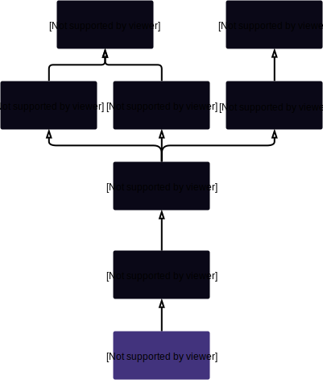

# PurgeableSynth

## Description

This is a [Synth](Synth.md) where all the holders can be force-[exchanged](Synthetix.md#exchange) back to `sUSD` at current rates so that the contract can be removed from the system or otherwise repurposed. In order to be liquidated, a Synth must either be frozen (if it is an inverse synth) or have its total outstanding supply worth less than $100\,000$ USD. Hence it is mainly useful for eliminating Synths which are unused or at the end of their useful life. The value of the token is read from the system's central [ExchangeRates](ExchangeRates.md) contract.

Purgeable synths were introduced by [SIP-3](https://github.com/Synthetixio/SIPs/blob/master/SIPS/sip-3.md) in response to increasing gas costs associated with minting, and to allow faster reconfiguration of inverse synths.

**Source:** [PurgeableSynth.sol](https://github.com/Synthetixio/synthetix/blob/master/contracts/PurgeableSynth.sol)

## Architecture

---

### Inheritance Graph

<centered-image>
    
</centered-image>

---

### Related Contracts

* [`ExchangeRates`](ExchangeRates.md)

---

### Libraries

* [`SafeDecimalMath`](SafeDecimalMath.md) for `uint`

---

## Variables

---

### `maxSupplyToPurgeInUSD`

Purging this Synth is disallowed unless the value of its supply is less than this. Initialised to $100\,000$.

**Type:** `uint public`

---

### `exchangeRates`

The contract address to obtain price information from.

It is necessary to know the current price of this Synth to work out whether it is below the purging threshold.

**Type:** `ExchangeRates public`

---

## Functions

---

### `contructor`

Initialises the [`exchangeRates`](#exchangerates) address, and the inherited [`Synth`](Synth.md) instance.

??? example "Details"
    **Signature**

    `constructor(address _proxy, TokenState _tokenState, Synthetix _synthetix, IFeePool _feePool, string _tokenName, string _tokenSymbol, address _owner, bytes32 _currencyKey, ExchangeRates _exchangeRates) public`

    **Superconstructors**

    * [`Synth(_proxy, _tokenState, _synthetix, _feePool, _tokenName, _tokenSymbol, _owner, _currencyKey)`](Synth.md#constructor)

---

### `purge`

Allows the owner to liquidate all holders of this token back to `sUSD` if the total value of this Synth is worth less than [`maxSupplyToPurgeInUSD`](#maxsupplytopurgeinusd) US dollars at current prices, or if the token is an inverse synth whose price is frozen.

If this is successfully invoked, balances in the provided list of addresses will be deleted, and an equivalent value of sUSD credited to their account.

??? example "Details"
    **Signature**

    `purge(address[] addresses) external`

    **Modifiers**

    * [`Proxyable.optionalProxy_onlyOwner`](Proxyable.md#optionalproxy_onlyowner)

    **Preconditions**

    * Either:
        * This Synth's total is less than the value of [`maxSupplyToPurgeInUSD`](#maxsupplytopurgeinusd) [priced in terms of this currency](ExchangeRates.md#effectivevalue); or
        * This currency's price is [frozen](ExchangeRates.md#rateisfrozen).
    * This currency's price [must not be stale](ExchangeRates.md#rateisstale).

    **Emits**

    * [`Purged(holder, amountHeld)`](#purged) for each `holder` in `addresses`. The `amountHeld` is the `holder`'s balance of this currency at the time of liquidation.

---

### `setExchangeRates`

Allows the owner to set the address of the [exchange rates contract](ExchangeRates.md).

??? example "Details"
    **Signature**

    `setExchangeRates(ExchangeRates _exchangeRates)`

    **Modifiers**

    * [`Proxyable.optionalProxy_onlyOwner`](Proxyable.md#optionalproxy_onlyowner)

    **Preconditions**

    * The caller must be the owner of this contract.

---

## Events

---

### `Purged`

Records that a balance of this currency was liquidated back to `sUSD` for a particular account.

This event is emitted from the Synth's [proxy](Proxy.md#_emit) with the `emitPurged` function.

**Signature:** `Purged(address indexed account, uint value)`

---
