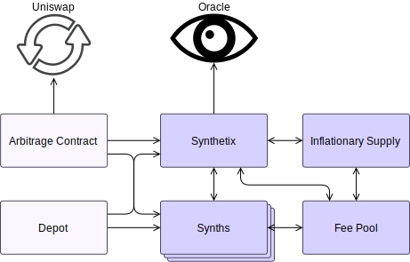

# Smart Contract Architecture

The Synthetix smart contract architecture is composed of a number of core contract complexes, and some auxiliary contracts that enhance the general system functionality and liquidity of the tokens.

A high-level view of the contracts and the relationships between them is described in the following diagram.

<centered-image>
    
</centered-image>

The oracle, Synthetix, synths, inflationary supply, and fee pool elements comprise the core of the system. The arbitrage and depot contracts are supporting components which, while they do not alter the fundamental behaviour of system tokens, ensure the economic health of the system. They do this by making sure that SNX and synths flow freely through markets like Uniswap and Mintr, improving liquidity and encouraging prices to be close to their theoretically correct values.

Each of the elements in this graph may be a complex composed of several contracts, as described below. Some relatively unimportant links have been omitted, but more detailed descriptions are available at the documentation pages for each specific contract.

<section-sep />

## Core Components

---

### Synthetix

!!! example "Responsibilities"
    * Implements the SNX token.
    * Tracks operational synths.
    * Issues and burns synths.
    * Exchanges between synth flavours.
    * Mints the inflationary supply.
    * Maintains the system debt ledger.

Synthetix contract communicates with [synths](#synths) to manage their supply, as well as the [fee pool](#fee-pool) to remit fees when synth exchanges occur. In order to properly convert between synths, and to understand value of debt induced by minting tokens, the Synthetix contract retrieves current token prices from the [oracle](#oracle). This contract also communicates with the [inflationary supply](#inflationary-supply) complex to mint the correct quantity when expanding the supply of SNX, and to distribute the new tokens appropriately.

Along with the debt ledger, which is a time series history of the overall value of the synthetix ecosystem, issuance data for the current fee period is updated whenever synths are issued or burnt. This complex is also responsible for pushing historical issuance information to the fee pool, so that as fee periods roll over, a record of what portion of the total system debt is owned by different issuers is known when computing their fee entitlements.

**Constituent Contracts**

Contract | Description
---------|------------
[`Synthetix`](Synthetix.md) | The main token contract.
[`SynthetixState`](SynthetixState.md) | An auxiliary state contract that sits alongside Synthetix, which tracks current issuer data and the debt ledger.

---

### Synth

!!! example "Responsibilities"
    * Implements all synth tokens.
    * Liquidates frozen inverse synths.

Many instances of the Synth token contract are deployed, one for each flavour of synth, including inverse synths. Since they run the same logic, synths are largely interchangeable, being distinguished only by their names and prices.

Synths implement their own issuance and burning logic, but only the [Synthetix](#synthetix) and [fee pool](#fee-pool) contracts may invoke them. The Synthetix contract uses these functions for issuance and burning by stakers, while the fee pool uses them to convert synths collected as fees to XDRs when they are deposited into the fee pool address.

Purgeable Synths also retrieve prices from the [oracle](#oracle) at the time of their liquidation to check if the value of their circulating supply is low enough to liquidate.

**Constituent Contracts**

Contract | Description
---------|------------
[`Synth`](Synth.md) | The base ERC20 token contract comprising most of the behaviour of all synths.
[`PurgeableSynth`](PurgeableSynth.md) | A synth contract that can be liquidated at the end of its life, if its supply is low enough or it is a frozen inverse synth.

---

### Fee Pool

!!! todo "COMPLETE ME"
    please

!!! example "Responsibilities"
    * Defines the boundaries of recent fee periods, tracking the fees and rewards to be distributed in each one.
    * Allows anyone to roll over to the next fee period once the current one has closed.
    * Holds the current exchange fee rate and computations.
    * Accumulates synth exchange fees, holding them as a pool of XDR synths.
    * Manages the details of the last several mint/burn events for each account, in order to compute the quantity of fees and rewards they are owed.
    * Allows issuers (or their delegated hot wallets) to claim any fees owed to them.

The fee pool holds the accumulated system fees, and determines the portion of fees and rewards that issuers are entitled to claim in exchange for their efforts in backing the system.

**Constituents**

Contract | Description
---------|------------
[`FeePool`](FeePool.md) | The main contract responsible for computing and storing the level of fees and rewards issuers are entitled to.
[`FeePoolState`](FeePoolState.md) | Stores a limited history of issuance data per user.
[`FeePoolEternalStorage`](FeePoolEternalStorage.md) | Stores fee withdrawal times for each address.
[`DelegateApprovals`](DelegateApprovals.md) | Allows addresses to delegate to others the right to claim fees on their behalf.

---

### Inflationary Supply

!!! todo "COMPLETE ME"
    please

---

### Oracle

!!! todo "COMPLETE ME"
    please

---

<section-sep />

## Token Circulation

---

### Depot

!!! todo "COMPLETE ME"
    please

---

### Uniswap Arbitrage Contract

!!! todo "COMPLETE ME"
    please

---

<section-sep />

## Infrastructure

---

### Proxy

!!! todo "COMPLETE ME"
    please

Note that the [`Synthetix`](Synthetix.md), [`FeePool`](FeePool.md), and all [`Synth`](Synth.md) contracts exist behind their own individual [proxies](Proxy.md).

---

### Tokens

!!! todo "COMPLETE ME"
    please

---

### Utilities

!!! todo "COMPLETE ME"
    please

---
